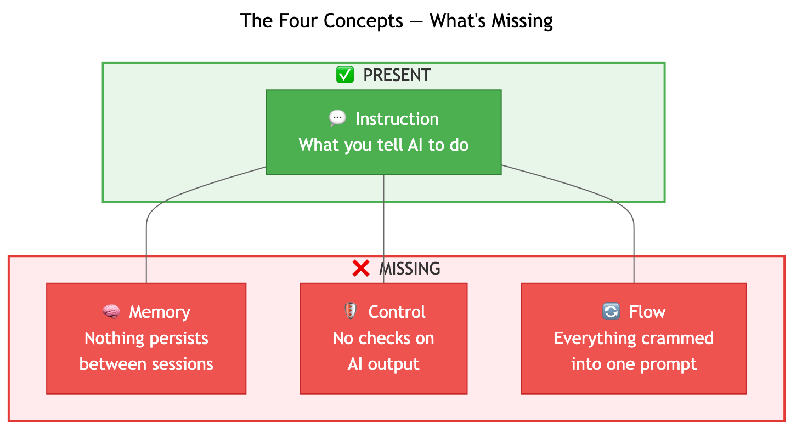
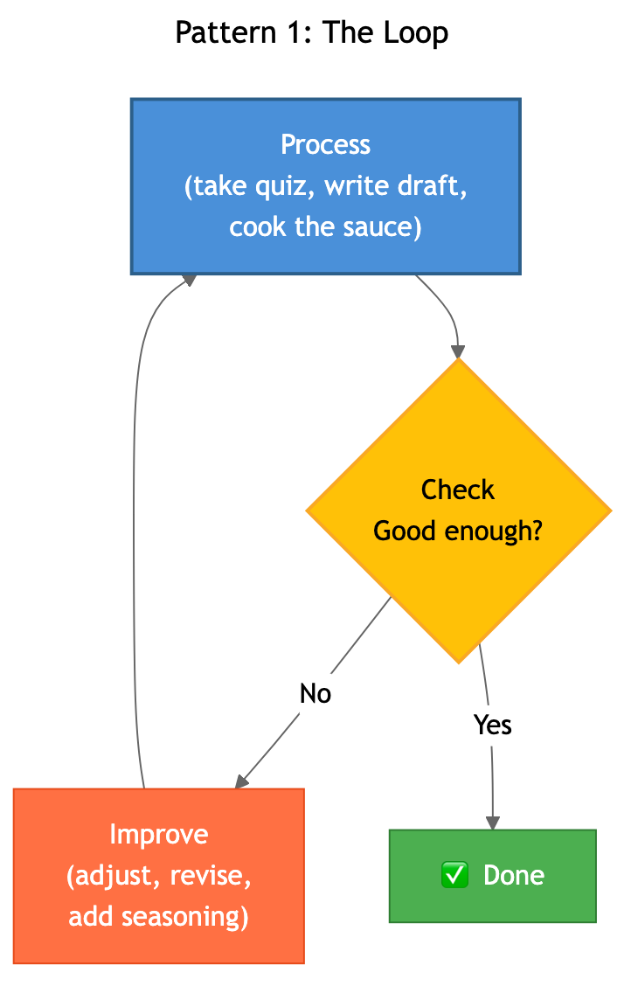
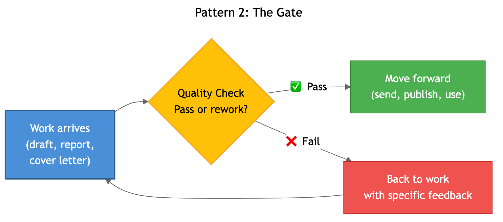
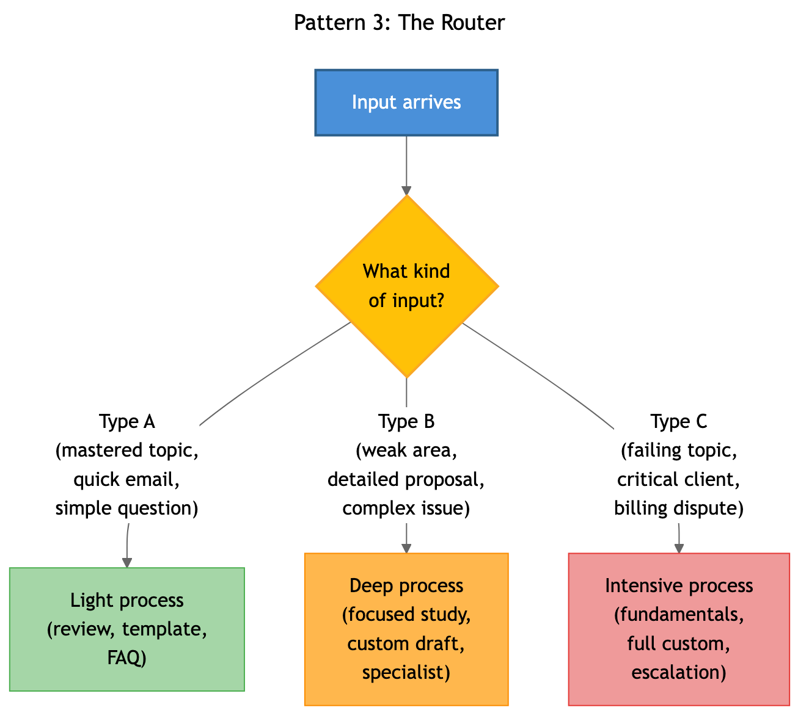

# From Prompts to Pipelines

### A Systems-Based Approach to Prompt Engineering and Agentic Workflows

You've used AI a hundred times. Sometimes it's magic. Sometimes it's useless. You re-explain your background every session. You manually check every output. You paste the same context into a new chat window and hope for the best.

**The problem isn't the AI. The problem is you're writing prompts when you should be building systems.**

This book teaches you to see the system, then build it. Four concepts. Six components. Three patterns. By the end, your AI workflows remember what happened, catch their own mistakes, and get better over time.



> *"Same AI, same task. Vague prompt: 11 out of 20. Structured prompt: 20 out of 20. Every run."*
> — [Eval notebook with full results](research/evals/notebooks/01-prompt-structure.ipynb)

---

## Read Act 1 Free

Act 1 teaches the universal framework. Works in ChatGPT, Claude, Gemini — whatever you have. No terminal required.

| Ch | Read | What You Learn |
|----|------|---------------|
| 1 | [You're Already Building Systems](book/chapters/ch01-draft.md) | The four concepts. Why your prompts break. |
| 2 | [Going Deeper](book/chapters/ch02-draft.md) | Push each concept, feel why manual systems collapse |
| 3 | [Design Patterns](book/chapters/ch03-draft.md) | Loop, Gate, Router — design on a napkin |

**[Start reading Chapter 1 →](book/chapters/ch01-draft.md)**

Or read the compiled version: **[Act 1 Beta Draft (~11,000 words) →](book/published/act1-beta-draft.md)**

---

## The Three Patterns

Every system you'll build uses some combination of these:

| | |
|---|---|
|  |  |



You learn these in Chapter 3. Then you use them in every chapter after.

---

## Act 2: What You Build

Act 2 is hands-on. One new component per chapter. By the end, your systems have all six working together.

```
PROMPT → STATE → SKILL → HOOK → CONNECTION → PIPELINE
(what you    (what it    (loaded     (automated   (live external   (multi-stage
 tell it)    remembers)   expertise)   checks)      data)            workflows)
```

| Ch | Preview | Component | What You Build |
|----|---------|-----------|---------------|
| 4 | [Structured Prompts](book/chapters/teasers/ch04-teaser.md) | Prompt | Persistent project instructions that load automatically |
| 5 | [State Files](book/chapters/teasers/ch05-teaser.md) | State | Memory that carries forward across sessions |
| 6 | [Skills](book/chapters/teasers/ch06-teaser.md) | Skill | Your voice, your rules, loaded on demand |
| 7 | [Hooks](book/chapters/teasers/ch07-teaser.md) | Hook | Automated checks that catch mistakes before they ship |
| 8 | [Connections](book/chapters/teasers/ch08-teaser.md) | Connection | Live data from the outside world |
| 9 | [Pipelines](book/chapters/teasers/ch09-teaser.md) | Pipeline | Multi-stage workflows with quality gates |
| 10 | [A Real System](book/chapters/teasers/ch10-teaser.md) | — | Production case study: 37-tool AI agent, 22K data points |
| 11 | [The Cost of Intelligence](book/chapters/teasers/ch11-teaser.md) | — | Token economics — spend smart, not more |
| 12 | [When Systems Break](book/chapters/teasers/ch12-teaser.md) | — | Every failure maps to a component. Diagnose in minutes. |
| 13 | [Composing Systems](book/chapters/teasers/ch13-teaser.md) | — | Wire multiple systems into a personal AI operating system |
| 14 | [Designing New Systems](book/chapters/teasers/ch14-teaser.md) | — | The 8-step process to build any system from scratch |
| 15 | [What's Next](book/chapters/teasers/ch15-teaser.md) | — | The framework outlasts every tool |

**[Get the full book →](https://frontierengineering.dev/book)**

---

## Inside the Book

**32 publication-quality diagrams.** Every chapter has system diagrams showing exactly what you're building and how the components connect. The system grows visually — you can see it getting more capable chapter by chapter.

**Real project files.** Every Act 2 chapter has downloadable starter files — the actual CLAUDE.md files, state files, skill documents, and hook scripts you build along the way. **[Browse downloads →](downloads/)**

**Production evidence.** Not toy examples. The eval notebooks, production system descriptions, and case study are based on systems running daily in a real business.

| Evidence | What It Proves |
|----------|---------------|
| [Prompt Eval: 11/20 → 20/20](research/evals/notebooks/01-prompt-structure.ipynb) | Structured prompts are categorically better |
| [Study System (production)](research/systems/study-system/) | 127 items, quiz scoring, gap detection |
| [Work System (production)](research/systems/work-system/) | 15 agents, 15 skills, 80K+ reference docs |
| [Content System (production)](research/systems/content-system/) | 7-stage pipeline, 26 posts, 24/30 quality gate |

---

## The Framework at a Glance

**4 Universal Concepts** (tool-agnostic, taught in Act 1):

| Concept | The Failure It Prevents |
|---------|------------------------|
| **Instruction** | "It didn't do what I wanted" |
| **Memory** | "I have to re-explain everything every time" |
| **Control** | "It gave me confident garbage" |
| **Flow** | "It tried to do everything at once" |

**6 Components** (built in Act 2):

| Component | What It Does |
|-----------|-------------|
| **Prompt** | Persistent instructions that load every session |
| **State** | Files that track what happened across sessions |
| **Skill** | Reusable expertise documents loaded on demand |
| **Hook** | Automated checks that catch mistakes |
| **Connection** | Live data from external tools and APIs |
| **Pipeline** | Multi-stage workflows with quality gates |

**3 Patterns**: Loop, Gate, Router. You learn them in Chapter 3. You use them in every chapter after.

**Not tied to one tool.** Works in Claude Code, OpenAI Codex, Kimi CLI, Cursor, or whatever ships next.

---

## Status

**15 chapters. ~53,000 words. 32 diagrams. PDF ready.**

Act 1 is free. Act 2 is in the full book.

**[Start with Chapter 1 →](book/chapters/ch01-draft.md)** · **[Get the full book →](https://frontierengineering.dev/book)**

---

## About

**Terrence Battlehunt.** Network engineer. Founder of [Frontier Engineering](https://frontierengineering.dev). Based abroad, building products and raising his daughter.

The systems in this book are what he uses daily. Three personal systems and a production business system. Every chapter comes from building and running those. First book.

[@bmoreopensource](https://twitter.com/bmoreopensource) · [Engineering Abroad](https://engineeringabroad.substack.com)
