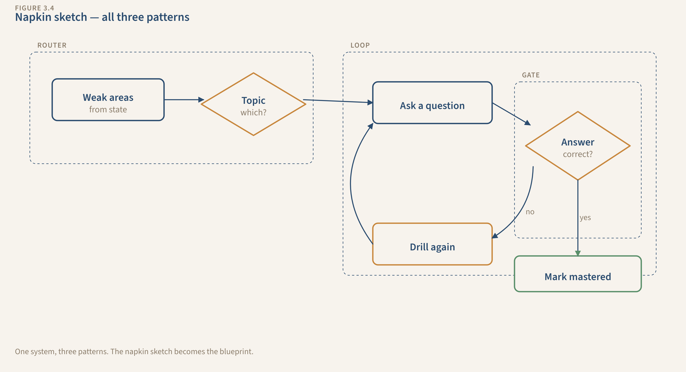

# From Prompts to Pipelines

### A Systems-Based Approach to Prompt Engineering and Agentic Workflows

You've used AI a hundred times. Sometimes it's magic. Sometimes it's useless. You re-explain your background every session. You manually check every output. You paste the same context into a new chat window and hope for the best.

**The problem isn't the AI. The problem is you're writing prompts when you should be building systems.**

A prompt is one input. A system is the whole loop — instruction, memory, control, and flow. This book teaches you to see the system, then build it. You'll go from one-shot prompts that work once to full pipelines that run reliably, remember what happened, catch their own mistakes, and get better over time.

> *"We tested this. Same AI, same task. Vague prompt: 11 out of 20. Structured prompt: 20 out of 20. Every run."*
> — [Eval notebook with full results](research/evals/notebooks/01-prompt-structure.ipynb)

---

## Status: Complete First Draft

**All 15 chapters drafted. ~50,000 words. Scored and reviewed.**

| Area | Status |
|------|--------|
| Act 1 — Universal Concepts (Ch 1-3) | Drafted, reviewed, scored 28-30/30 |
| Act 2 — Build Chapters (Ch 4-9) | Drafted, reviewed, scored 23-27/30 |
| Act 2 — Production & Mastery (Ch 10-15) | Drafted, reviewed, scored 22-30/30 |
| Downloads | Ch 4-7 complete (54 project files) |
| Research | 8 research docs with verified CLI behavior |
| Diagrams | 14 Mermaid diagrams (Act 1 + Ch 9-10) |
| Production Evidence | 3 systems + 1 production case study |

**Average score: 25.9/30** across 11 reviewed chapters. All pass (minimum 20/30). One perfect score (Ch 14).

---

## What You'll Build

Four real systems that grow across the entire book. Each starts as a basic prompt and ends as a full 6-component pipeline.

| System | You Start With | You End With |
|--------|---------------|-------------|
| **Study** | "Quiz me on cloud computing" | An adaptive learning system that tracks weak areas, adjusts difficulty, verifies answers, pulls live data, and plans the next session |
| **Job Hunting** | "Write me a cover letter" | A career campaign that tracks applications, tailors materials from a loaded career profile, catches fabricated details, and learns which approaches get callbacks |
| **Project Management** | "Help me plan this project" | A project operations system that pulls live data, generates status updates for different audiences, flags risks, and tracks everything |
| **Content** | "Write a blog post about X" | A content pipeline that researches, drafts in your voice, fact-checks against sources, enforces quality gates, and publishes |

These aren't hypothetical. The author runs all four in production. [See the evidence.](research/systems/)

---

## What Makes This Different

**Every other AI book teaches prompts. This one teaches systems.**

Most books stop at "write better prompts." That's one component. This book teaches six:

```
PROMPT → STATE → SKILL → HOOK → CONNECTION → PIPELINE
(what you    (what it    (loaded     (automated   (live external   (multi-stage
 tell it)    remembers)   expertise)   checks)      data)            workflows)
```

Each chapter adds one component. By the end, your systems have all six working together. Then a production case study shows what these patterns look like at business scale — MongoDB aggregation pipelines, AI agents with 37 tools, and forensic matching that discovers hidden supply chain relationships.

**It's not tied to one tool.** The concepts work in Claude Code, OpenAI Codex, Kimi CLI, Cursor, or whatever ships next year.

**Every claim is backed by evidence.** Not "trust me" — [here's the data](research/METHODOLOGY.md).

---

## Read It Now (Free)

**Act 1 is free.** Three chapters, ~11,000 words. Run 5 hands-on sessions in any AI tool and walk away understanding why your prompts break — and what to do about it.

### [Read Act 1 →](book/published/act1-beta-draft.md)

Or chapter by chapter:

1. **[You're Already Building Systems](book/chapters/ch01-draft.md)** — You run a study quiz, get great results, then watch it forget everything.
2. **[Going Deeper](book/chapters/ch02-draft.md)** — You push through 3 more sessions, manually patching each concept.
3. **[Design Patterns](book/chapters/ch03-draft.md)** — Loop, Gate, Router — three shapes that describe every AI system.


*By Chapter 3, you can design a system on paper. Act 2 builds it for real.*

---

## Download the Project Files

Every Act 2 chapter has downloadable starter and finished files — the actual CLAUDE.md files, state files, skill documents, and hook scripts.

**[Browse the downloads →](downloads/)**

| Folder | Chapter | What's Inside |
|--------|---------|---------------|
| [`before/`](downloads/before/) | Act 1 | The vague one-liner prompts most people start with |
| [`ch04-prompt/`](downloads/ch04-prompt/) | Ch 4: Structured Prompts | Root CLAUDE.md + 4 system CLAUDE.md files |
| [`ch05-state/`](downloads/ch05-state/) | Ch 5: State Files | + 4 state files with @import wiring |
| [`ch06-skill/`](downloads/ch06-skill/) | Ch 6: Skills | + 5 skill files in .claude/skills/ |
| [`ch07-hook/`](downloads/ch07-hook/) | Ch 7: Hooks | + 7 hook scripts + settings.json |

Each folder is self-contained with every file your system needs after that chapter.

---

## Full Book Outline (15 Chapters)

### Act 1: The System (Universal — any AI tool)

| Ch | Title | Score |
|----|-------|-------|
| 1 | You're Already Building Systems | 28/30 |
| 2 | Going Deeper | 30/30 |
| 3 | Design Patterns | 29/30 |

### Act 2: The Build (CLI-demonstrated)

| Ch | Title | Component | Primary System | Score |
|----|-------|-----------|---------------|-------|
| 4 | Structured Prompts | Prompt | Study | — |
| 5 | State Files | State | Job Hunting | 27/30 |
| 6 | Skills | Skill | Content | 24/30 |
| 7 | Hooks | Hook | Job Hunting | 23/30 |
| 8 | Connections | Connection | Study | 27/30 |
| 9 | Pipelines | Pipeline | Content | 27/30 |

### Act 2: Production & Mastery

| Ch | Title | Score |
|----|-------|-------|
| 10 | A Real System — Production Case Study | 22/30 |
| 11 | The Cost of Intelligence | 23/30 |
| 12 | When Systems Break — Debugging | 28/30 |
| 13 | Composing Systems — Personal AI OS | 28/30 |
| 14 | Designing New Systems | **30/30** |
| 15 | What's Next | 26/30 |

[Full detailed outline →](book/outline-v3.md) · [Production case study preview →](book/chapters/ch10-showcase.md)

---

## The Evidence

| Evidence | What It Proves |
|----------|---------------|
| [Prompt Eval: 11/20 → 20/20](research/evals/notebooks/01-prompt-structure.ipynb) | Structured prompts are categorically better |
| [Study System (production)](research/systems/study-system/) | 127 items, quiz scoring, gap detection |
| [Work System (production)](research/systems/work-system/) | 15 agents, 15 skills, 80K+ reference docs |
| [Content System (production)](research/systems/content-system/) | 7-stage pipeline, 26 posts, 24/30 quality gate |
| [Production Case Study](book/chapters/ch10-showcase.md) | MongoDB pipelines, 37-tool AI agent, forensic matching |

---

## The Framework

**4 Universal Concepts** — tool-agnostic:

| Concept | The Failure It Prevents |
|---------|------------------------|
| **Instruction** | "It didn't do what I wanted" |
| **Memory** | "I have to re-explain everything every time" |
| **Control** | "It gave me confident garbage" |
| **Flow** | "It tried to do everything at once" |

**6 Components** — what you build:

| Component | Chapter | What It Does |
|-----------|---------|-------------|
| Prompt | Ch 4 | Persistent project instructions (CLAUDE.md) |
| State | Ch 5 | Files that track what happened across sessions |
| Skill | Ch 6 | Reusable expertise docs loaded on demand |
| Hook | Ch 7 | Automated checks that catch mistakes |
| Connection | Ch 8 | Live data from external tools and APIs |
| Pipeline | Ch 9 | Multi-stage workflows with quality gates |

**3 Design Patterns**: Loop (improve iteratively), Gate (check before shipping), Router (different inputs → different handling)

---

## Get Involved

**Read Act 1 and tell us what you think.** Leave feedback as [GitHub Issues](../../issues).

**Run the evals yourself.** The [notebooks](research/evals/) work with any AI API.

---

## About

Written by a network engineer who builds AI systems in production — not a researcher writing about theory. Three personal systems plus a production business system run daily and inform every chapter.

CLI-demonstrated (terminal-first, because you need to see the system's parts) and interface-agnostic (same patterns work in Claude Code, Codex, Kimi CLI, Cursor, or whatever ships next).

**[Start reading →](book/published/act1-beta-draft.md)**
