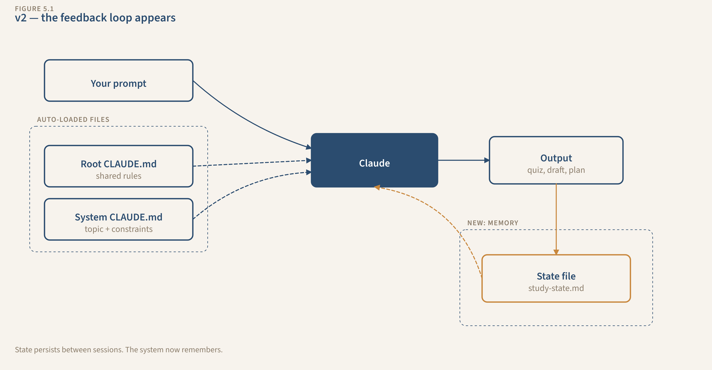

# Chapter 5: State Files. Teaching Your Systems to Remember

You applied to six jobs last week. You open Claude Code in your `job-hunting/` folder. You paste a new job posting. Claude drafts a solid cover letter, but it doesn't know you already applied to this company's competitor last Tuesday with a different angle. It doesn't know which resume version got you a callback. It doesn't know you've been emphasizing "data infrastructure" in your last three letters because that's what's working.

It starts from zero. Every. Single. Time.

You could paste all of that context into your prompt. But after 20 applications, that paste is three pages long. After 50, it's unmanageable. And you're the one maintaining it, by hand, in a text file, copying and pasting every session.

Your CLAUDE.md told Claude WHO you are. But it can't tell Claude what HAPPENED. Instructions are static. Your job search is dynamic. It changes every day.

---

## See the System

Here's what your Job Hunting System looks like right now:

```
[Job posting] + [CLAUDE.md auto-loaded] → [Claude] → [Cover letter + resume bullets]
```

Good output. No feedback arrow. Each session is independent. The system has Instruction but no Memory.

Here's what it looks like after this chapter:

```
[Job posting] + [CLAUDE.md + State auto-loaded] → [Claude] → [Output + State updated]
                                                                       ↓
                                                             [State file on disk]
```

The feedback arrow appears. The system remembers.

---

## The New Component: State Files

A state file is a plain text document that lives in your system's folder. It tracks what happened. Not what you want (that's CLAUDE.md), but what IS. Applications submitted, dates, statuses, outcomes, patterns.

Claude reads it at the start of every session. Writes to it at the end. You don't paste it. You don't copy it. It loads automatically, because you'll add one line to your CLAUDE.md telling Claude where it is.

Without state, the system treats every session as day one. With state, session 10 is informed by sessions 1 through 9. That's the difference between 10 isolated cover letters and a campaign that learns.

---

## Build It: Job Hunting System v2

**Components Used:** `[Prompt (CLAUDE.md)] + [State (NEW)]`
**New this chapter:** The state file, a markdown document Claude reads and writes each session

### Step 1: Create the state file.

In your `job-hunting/` folder, create a new file called `job-state.md`:

```markdown
# Job Hunting State

## Applications

| # | Company | Role | Date Applied | Resume Version | Cover Letter Approach | Status | Callback? | Notes |
|---|---------|------|-------------|----------------|----------------------|--------|-----------|-------|
| | | | | | | | | |

## Resume Versions

| Version | Emphasis | Where Sent | Callback Rate |
|---------|----------|-----------|---------------|
| v1-general | Broad experience | — | — |

## Patterns & Insights

(After 5+ applications, Claude will note what's working and what isn't.)

## Interview Log

| Company | Date | Questions Asked | What Went Well | What I'd Change |
|---------|------|----------------|----------------|-----------------|

## Next Actions

- [ ] (Claude updates this at session end)
```

This is a **status table** — it works like a spreadsheet in markdown. Each row is one item (an application, a task, a topic, a draft), and columns track the details. You'll use this pattern in every system going forward. Right now the headers are there but the rows are empty. That's intentional. The system fills them in. You don't maintain this by hand. That's the whole point.

You'll also notice **session logs** further down — timestamped entries of what happened each time you worked. These are useful when the work is sequential: study sessions, drafts, project meetings. The Interview Log above is one example.

### Step 2: Wire it into your CLAUDE.md.

Open `job-hunting/CLAUDE.md` and add a new section at the bottom:

```markdown
## State File

Current state: @job-state.md

Before you do anything, check what's in the state file: applications
I've submitted, patterns you've noticed, resume versions that are
getting callbacks.

At the end of every session, update job-state.md:
- Add any new applications to the Applications table
- Update statuses if I tell you about callbacks, interviews, or rejections
- Recalculate Callback Rate in the Resume Versions table
- Update Patterns & Insights if you notice something
- Update Next Actions based on what we did today

Never delete rows from the Applications table. If something is old,
mark the status as "Archived." Don't remove it.
```

This is the critical wiring. The `@job-state.md` reference tells Claude Code to load that file's contents into its working memory automatically when a session starts. When Claude reads your CLAUDE.md and hits `@job-state.md`, it goes and reads the entire contents of `job-state.md` as if you had pasted it into the conversation yourself. The file path is relative to where the CLAUDE.md lives — so `@job-state.md` means "look in this same folder for a file called `job-state.md` and pull in everything inside it." Without the `@`, the file sits on disk but Claude never opens it. It's like having a notebook in your desk drawer that you never pull out. You'll test this in the "Break It" section — remove the `@`, and watch Claude forget everything.

Your CLAUDE.md just became a conductor. In Chapter 4, it told Claude WHO you are and HOW to work. Now it tells Claude WHICH FILES to read and WHAT TO DO with them. CLAUDE.md orchestrates the state file.

### Step 3: Run Session 1 — first application.

Open Claude Code in your `job-hunting/` folder:

```
claude
```

Paste a real job posting (or a realistic one). Tell Claude to draft a tailored cover letter and resume bullets.

Here's what happens:

- Claude reads CLAUDE.md (your career info, format preferences, constraints)
- Claude reads `job-state.md` through the `@` import (empty, first session)
- Claude drafts the cover letter and resume bullets, same quality as Chapter 4
- Claude writes to `job-state.md`: adds the application to the table, notes the resume version used, records the cover letter approach, sets status to "Applied"

Open `job-state.md`. It now has one row in the Applications table. The system wrote it. You didn't.

### Step 4: Run Session 2 — different job, different session.

Close Claude Code. Open it again. Paste a different job posting.

Here's what happens:

- Claude reads CLAUDE.md + `job-state.md` (now has one row from last time)
- Claude sees Application #1. It knows you emphasized data infrastructure last time.
- For this new posting (say it's a different kind of role), Claude adjusts. If the role calls for a different strength, Claude uses a different resume version or creates a new one. The cover letter takes a different angle, not because you told it to, but because the state file shows what was already used.
- Claude writes to state: adds Application #2, notes the different approach, updates the Resume Versions table.

You didn't tell Claude about Application #1. You didn't paste your notes. It read the state file. Session 2 is informed by Session 1 automatically.

### Step 5: Run Session 3 — the pattern emerges.

Tell Claude that Application #1 got a callback but Application #2 hasn't heard back.

What happens:

- Claude updates statuses in the state file
- Claude recalculates callback rate — this is a **derived field**, a value calculated from your data rather than typed by you. "Callback rate by resume version." "Average quiz score by topic." "Completion percentage." Claude updates these when it writes to state. These are where patterns emerge. Here: the data-infrastructure resume at 100% (1/1), the general resume at 0% (0/1)
- Claude notes in Patterns & Insights: "Data infrastructure emphasis getting callbacks. General approach not converting."
- For the next application, Claude recommends the data-infrastructure angle unprompted. The state informed the strategy

After three sessions, the system has an opinion. Not because you programmed an opinion, but because the data in the state file reveals a pattern, and Claude surfaces it. That's the feedback loop. That's what Memory does.

---

## Extend It: Three More Systems Get State

Each system gets a state file and a CLAUDE.md update. Same pattern you just built — create the file, add the `@` reference, tell Claude what to read and write. The only things that change are the table columns and what counts as "progress."

| System | State File | What It Tracks | The Feedback Loop |
|--------|-----------|----------------|-------------------|
| **Study** | `study-state.md` | Topics, quiz scores, mastery levels, session log, weak areas | Session 2 targets weak areas from Session 1 instead of random coverage. The state file IS your level. |
| **Project Mgmt** | `project-state.md` | Tasks (with owner, status, dependency, due date), decisions log, blocked items | Monday morning, Claude reads state and generates a status report without you summarizing the week. |
| **Content** | `content-state.md` | Pieces (title, topic, status), topics covered, editorial calendar | Claude checks what was already written before suggesting topics. No more accidental repetition. |

For each one: create the state file in the system folder, add a `## State File` section to that folder's CLAUDE.md with `@[filename].md`, and tell Claude what to update at the end of every session. The wiring is identical to what you did for Job Hunting. The data is different. The pattern is the same.

---

## Maintain It: State Hygiene

State files aren't build-and-forget. They need upkeep, or they rot. Run through this checklist monthly (set a calendar reminder, 30 minutes):

- [ ] **Archive dead rows.** If your Applications table has 50 rows and 40 are "Rejected" or "Ghosted," those 40 are noise. Move them to an `## Archive` section at the bottom of the file. Keep active state lean: items with status "Applied," "Phone Screen," "Interview," or "Offer."
- [ ] **Check row count.** Your state file loads into Claude's working memory every session through the `@` import. A 20-row table is fine. A 50-row table is getting heavy. Past 100 rows, Claude may start overlooking entries near the bottom. Treat your state file like a clean desk, not a filing cabinet.
- [ ] **Spot stale data.** What's outdated? What's missing? What pattern should be captured that isn't? Unglamorous work, but it prevents drift.
- [ ] **Read it like Claude will.** Open your state file top to bottom. Does it tell a clear, current story? Or does it read like a cluttered database? If you can't parse it quickly, neither can Claude.

---

## What You Built

```
my-ai-systems/
├── CLAUDE.md                  ← root shared rules (Ch 4)
├── study-system/
│   ├── CLAUDE.md              ← updated: now references state
│   └── study-state.md         ← NEW: quiz scores, weak areas, session log
├── job-hunting/
│   ├── CLAUDE.md              ← updated: now references state
│   └── job-state.md           ← NEW: applications, resume versions, patterns
├── project-mgmt/
│   ├── CLAUDE.md              ← updated: now references state
│   └── project-state.md       ← NEW: tasks, decisions, blocked items
└── content/
    ├── CLAUDE.md              ← updated: now references state
    └── content-state.md       ← NEW: pieces, topics, calendar
```

Nine files. Five CLAUDE.md files from Chapter 4, now updated with state references. Four state files that Claude reads and writes every session.



*Your system after Chapter 5 — the feedback arrow appears. The system remembers.*

The system diagram for all four:

```
[Your input] + [CLAUDE.md + State auto-loaded] → [Claude] → [Output + State updated]
                                                                      ↓
                                                            [State file on disk]
```

The feedback arrow is real now. The system's output includes updating its own memory. Session 10 is informed by sessions 1 through 9.

---

## Break It on Purpose

### Test 1: Remove the wiring.

Open `job-hunting/CLAUDE.md`. Find the line that says `Current state: @job-state.md` and delete it (or comment it out by adding `<!--` before and `-->` after).

Start a new session. Paste a job posting. Claude drafts a cover letter, but it's generic. No reference to prior applications. No pattern-based recommendations. No "last time you emphasized data infrastructure and got a callback." The system is back to Chapter 4.

Restore the `@` line. Start another session. The system remembers again. The `@` import is the wiring. Without it, the state file is invisible.

### Test 2: Feed a duplicate.

Paste the same job posting from Application #1. If state is working, Claude should flag it: "You already applied to this company for this role on [date]. Status: [status]. Do you want to apply again, or update the existing application?"

If it doesn't flag the duplicate, your CLAUDE.md instructions for reading state need to be more explicit. Add: "Before drafting a cover letter, check the Applications table for this company. If I've already applied, tell me."

### Test 3: Check the Edit behavior.

Look at your state file after a few sessions. Did Claude update specific rows (changing a status from "Applied" to "Phone screen")? Or did it rewrite the entire file? Both work, but targeted row updates mean the system is using state efficiently. If Claude is rewriting the whole file every time, your rows might not be unique enough. Add dates or application numbers to make each row distinct.

---

## How to Know It's Clicking

Five checks:

**State file exists and is populated.** Open `job-state.md`. It has real data from at least 2 sessions: rows in the Applications table, dates, statuses. The system wrote this data, not you.

**Session 3 references Session 1.** In your third session, Claude mentions something from the first session (an application, a pattern, a recommendation) without you re-explaining it.

**Derived insights appear.** After 3+ entries, the Patterns & Insights section has something Claude wrote. A callback rate, a trend, a recommendation based on data. The system is synthesizing, not just recording.

**Duplicate detection works.** Paste a previously-used job posting. Claude flags it or references the prior application. The state file prevents redundant work.

**You can name the gap.** You can explain to someone: "The CLAUDE.md tells the system how I work. The state file tracks what happened. Together, the system has both instructions and memory. What's still missing: it doesn't have expertise loaded. It doesn't know my voice, my methodology, my standards beyond what I put in the instructions. That's skills, next chapter."
