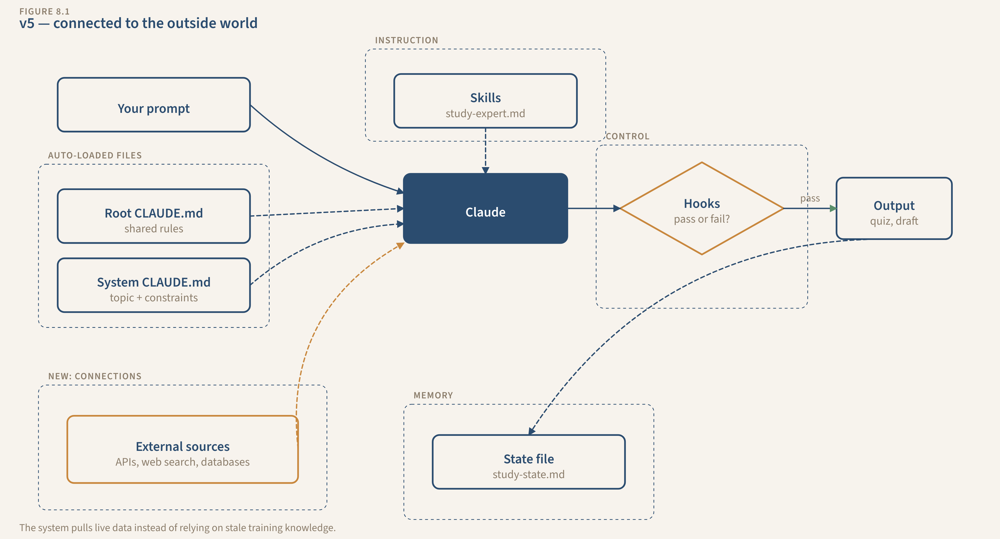

# Chapter 8: Connections — Your Systems Reach the Outside World

Your Study System is working. State file tracks your weak areas: networking at 62%, IAM at 68%, storage at 81%. The study-method skill calibrates explanations to how you learn. The quiz hook verifies every question has four options and one correct answer. You sit down for a Thursday evening session.

"Quiz me on VPC peering. I keep getting these questions wrong."

Claude pulls your state file, sees networking is flagged weak, loads your skill, and generates five questions. You take the quiz. Score: 3 out of 5. Claude updates your state. Same as last week.

Here's the problem. Those questions came from the same pool of knowledge Claude already has. Your notes are three months old. AWS released a new VPC feature last Tuesday that's already appearing on practice exams. A blog post on Medium explains peering better than anything in your study materials, using an analogy about apartment buildings that would have clicked for you immediately. A community site has 40 free practice questions specifically for the networking section of your exam.

Your system doesn't know any of that exists.

The state file knows you're weak on networking. The skill file knows you learn best through analogies. The hook verifies quiz quality. But none of those components can DO anything about the weakness except re-quiz you on the same material. The system can only work with what you've already given it. And you're the bottleneck. The only way new information gets in is if you find it yourself, copy it, and paste it into a file.

You could spend 30 minutes searching for better material, formatting it, and saving it where Claude can find it. But that's you doing the research manually. That's exactly the kind of work you built the system to handle.

What you need: the system goes out and GETS information. Searches the web for better explanations. Pulls your course materials from wherever you keep them. Finds practice resources you didn't know existed. The system becomes a researcher, not just a tutor.

A connection is a link that lets Claude reach outside your project folder. It can search the web, pull data from tools you already use, or find information you haven't manually provided.

---

## See the System

Your Study System right now:

```
[Your notes] + [CLAUDE.md + study-method skill + study-state.md]
                              |
                          [Claude]
                              |
                 [Quiz + Explanations + State write]
                              |
                    [HOOKS CHECK: quiz quality]
```

Everything inside the box is working well. But everything OUTSIDE the box? Invisible. The system processes what you've given it, and nothing more.

After this chapter:

```
[Your notes] + [CLAUDE.md + Skill + State]
             + [Web search results]
             + [Google Drive course materials (optional)]
                              |
                          [Claude]
                              |
                 [Quiz + Explanations using ALL sources]
                              |
                    [HOOKS CHECK: quiz quality + source verification]
```

Two new arrows feed into the system from outside. The box is open. The system sees more than you told it.

---

## The New Component: Connections

A connection lets Claude pull data from outside your project folder. Think of it the same way you'd open a browser tab, check your Google Drive, or look something up while working.

Here's what caught me off guard: some connections are already built in. Claude can search the web and fetch pages without you installing anything. You just have to tell it that's allowed. Others, like connecting to tools like Notion, Google Drive, or a database, need a one-time setup. And a third category, connecting to local tools on your computer, needs a bit more work.

**Three types of connections you'll use:**

**Web search and page fetching.** Claude searches the web or reads a specific URL. You ask "find alternative explanations of VPC peering" and Claude searches, reads what it finds, and uses that information in its response. These are built-in tools that ship with Claude Code. No installation, no configuration beyond giving permission. This is where you start.

**Remote server connections.** Think of these as plugins for cloud tools. A remote connection links Claude to a specific service: Notion, Sentry, Stripe, Google Drive, Slack. Once connected, Claude can read data from that tool. The technical name is "MCP server" (Model Context Protocol), but just think of it as a plugin that connects Claude to a tool you already use. Setup is one command and a browser login.

**Local server connections.** These connect Claude to programs running on your own computer: a local database, a folder of files outside your project, a custom script. They need Node.js installed and a bit more terminal comfort. Optional for this book. Mentioned so you know they exist.

**When to connect vs. when local files are enough:**

Your career history doesn't change between sessions. Keep it in a skill file. No connection needed.

You need the current version of AWS documentation, not the version from Claude's training data. Web search.

Your course materials live in Google Drive and you're tired of copy-pasting them. Remote server connection.

You have a folder of study PDFs on your computer that lives outside your project. Local server connection, or just copy them into your project folder. Simpler.

**The trade-off nobody warns you about.** Connections are powerful but fragile. Websites go down. Authentication expires. Services change their setup. Local files are always available. A system that REQUIRES a connection to function is a system that breaks when WiFi drops.

Build your connections as enhancements, not foundations. The system should work without them, giving you a narrower answer using local data rather than crashing because it can't reach the web.

---

## Build It: Study System v5, Adding Connections

**Components Used:** `[Prompt (CLAUDE.md)] + [State] + [Skill] + [Hook] + [Connection (NEW)]`

### Step 1: Enable web search (the zero-setup connection).

Good news: this one's already installed. Claude Code ships with web search and page fetching built in. The only thing missing is your permission.

Open `.claude/settings.json` — the same file where you registered hooks in Chapter 7. You're adding one section that flips the switch: Claude can now look things up in real time instead of relying only on your files and its training data.

```json
{
  "permissions": {
    "allow": [
      "WebSearch",
      "WebFetch"
    ]
  },
  "hooks": {
    "PreToolUse": [
      {
        "matcher": "Edit|Write",
        "hooks": [
          {
            "type": "command",
            "command": "bash .claude/hooks/verify-cover-letter.sh"
          },
          {
            "type": "command",
            "command": "bash .claude/hooks/check-duplicate.sh"
          }
        ]
      }
    ]
  }
}
```

**Watch the commas.** JSON is picky. Every section except the LAST one inside a pair of curly braces needs a comma after its closing brace. In the file above, `"permissions"` has a comma after its closing `}` because `"hooks"` comes after it. But `"hooks"` does NOT have a comma after its closing `}` because it's the last section. If you get a "JSON parse error" when Claude Code starts, a missing or extra comma is almost always the reason. Compare your file character-by-character against the example above.

Your `settings.json` is the control panel for the whole system: hooks on one side, permissions on the other. One file configures everything.

If you prefer a graphical interface, these same permissions can be set in Cowork or VS Code settings.

### Step 2: Update the Study System's CLAUDE.md.

Permission opens the door. But a door that's always open lets in noise. Claude needs to know WHEN to search and what to do with what it finds — otherwise it'll search for things your notes already cover perfectly well. Open `study-system/CLAUDE.md` and add:

```markdown
## Connections

You have web search access. Use it when:
- I'm weak on a topic (check study-state.md) and need a better explanation
  than what's in my notes
- A concept needs a current, real-world example
- I ask about something not in my existing materials
- You need to verify whether your explanation is accurate for the
  current version of the technology

When you search:
- Prefer official documentation and well-known educational sites
- Always include the source URL with any external information
- If you can't find reliable information, say so. Don't guess
- Never present web search results as if they came from my notes

If web search is unavailable (no internet, tool not enabled), continue
with what you have. Note what you couldn't look up so I can research
it later.
```

Your CLAUDE.md is becoming a real conductor now. It tells Claude when to read state, which skills to load, when to reach outside the project, and how to handle what it finds. Three chapters ago this file was a few paragraphs of instructions. Now it orchestrates an entire system.

### Step 3: Run a session with web search in action.

Open Claude Code in your `study-system/` folder. Tell Claude: "I'm weak on VPC peering. My quiz scores on networking topics are below 70%. Find me a clear explanation and create practice questions based on it."

Now watch the system reach outside for the first time:

Claude reads `study-state.md`, confirms networking is a weak area, 62% last session. Claude reads your study-method skill, knows you prefer examples-first, analogies from your field. Then Claude searches the web for VPC peering explanations. It finds two or three sources: an AWS documentation page, a tutorial blog, maybe a Stack Overflow answer.

Here's the part that matters: Claude doesn't just paste the web results at you. It synthesizes them into an explanation that matches YOUR learning style, the style defined in your skill file. If you learn through analogies, the explanation uses analogies. If you need diagrams described, you get diagrams described. Then Claude generates five quiz questions based on the external material, covering angles your own notes never included.

The quiz hook fires. Format checks pass. State updates.

**What to check.** The explanation includes information that wasn't in your notes. Source URLs are included, so you can click them and verify the information is real. The quiz questions cover aspects of VPC peering you hadn't studied before. And `study-state.md` shows the session happened and what topics were covered.

The system just did research for you. Last chapter, it could only quiz you on what you'd already provided. Now it goes out, finds better material, and builds quizzes from multiple sources: your notes, the web, and the skill's teaching preferences. The constraint moved. You're no longer limited by what you paste in.

### Step 4: (Optional) Connect to a tool you already use.

This step is optional. If you keep study materials in Notion, Google Drive, or another cloud tool, you can connect Claude to it directly. If you don't use any of these, or if web search alone feels like a big enough upgrade, skip this. Come back when you're ready.

Remote server connections are the easiest type to set up. One command, one browser login. Here's the Notion example.

The command below adds a new connection. It breaks down like this: `claude mcp add` means "add a new connection." `--transport http` means "this is a remote server, not something running on your computer." `notion` is the name you're giving it (you'll use this name later to manage it). The URL at the end is where the connection lives.

```
claude mcp add --transport http notion https://mcp.notion.com/mcp
```

Start Claude Code and type `/mcp`. You'll see Notion listed. It needs authentication: Claude opens your browser, you log in to Notion, you grant access. Done. Now ask Claude: "What's in my Notion workspace?" or "Find my networking study notes in Notion."

Other tools follow the same pattern. The command is always `claude mcp add --transport http [name] [url]`. The authentication is always a browser login. Sentry, Stripe, Slack, Google Drive, Linear: same pattern, different URLs.

**If it doesn't connect:** Check three things. Did you type the URL correctly? Does the service require you to have an account with certain permissions? And try running `/mcp` inside Claude Code. It shows the status of every connection and lets you retry authentication.

**If you don't use any of these tools:** That's fine. Web search is the primary connection for this book. Everything in the rest of this chapter works with web search alone. Remote server connections are a bonus for people who happen to use compatible tools.

### Step 5: Run another session. The difference compounds.

New session. "Quiz me on networking. Focus on my weak areas."

Claude reads state, sees networking is still flagged weak. Searches the web for current practice questions. If you connected Notion, it pulls your lecture notes too. The quiz that comes back blends three sources: your own notes, last session's web material, and newly found practice questions. Broader and deeper than anything the system could produce from local files alone.

The system isn't just a tutor anymore. It's a tutor that does its own research. Same six files you've been building. The only difference is one permission and a few lines telling Claude when to look outside.

### Step 6: Verify the hooks still catch problems.

This matters. Connections bring in external data, which means external errors. The web is full of wrong answers.

Your hooks from Chapter 7 check format: question count, answer markers, word count, banned words. They won't catch a factually wrong answer pulled from a bad web source. That's beyond what a shell script can do. But they DO still verify structure, and they prevent the most common failures (missing answers, wrong format, placeholder text).

Test it. Tell Claude: "Search for common AWS networking topics and build a quiz." The hook fires and verifies the format. If you want factual verification too, that's a place where you'd add a more sophisticated check later, or review the content yourself. Hooks handle the mechanical checks. Your judgment handles the rest.

Connections bring in the world. Your validation layer still guards the gate. The web doesn't get a free pass just because it's external data. Your hooks don't care where the information came from. They check the output regardless. That's why you built the validation layer BEFORE connections. The guard rails were in place before the system opened up.

---

## Where This Goes: Production Connections

Here's what connections look like when they grow up.

A content production system connects to three external sources simultaneously. A web search connection finds current statistics and trends for the topic being written about. A Notion connection pulls the editorial calendar to check what's already been published and what's coming up. A Google Drive connection reads the brand guidelines PDF that lives in a shared folder.

The system doesn't just use one connection. It triangulates. The web search provides current data. Notion provides editorial context. Google Drive provides brand rules. All three feed into the same draft, which then runs through the hook pipeline before anyone sees it.

That's three connections, each serving a different purpose, each making the output better in a specific way. Your Study System uses one or two connections. A production system uses whatever it needs. Same concept, more wires.

---

## Extend It: Connections for the Other Three Systems

You've seen the pattern: give permission in `settings.json`, add a "Connections" section to the system's CLAUDE.md that tells Claude when to search and how to handle what it finds. The structure is the same every time. Here's the template — add this to each system's CLAUDE.md, swapping in the triggers and rules from the table below:

```markdown
## Connections

You have web search access. Use it when:
- [trigger 1 — when the system needs outside information]
- [trigger 2]
- [trigger 3]

When you search:
- [rule 1 — how to handle what you find]
- [rule 2]
- If you can't verify something, flag it. Don't guess.

If connections are unavailable, continue with local files and note
what you couldn't look up.
```

Here's what changes for each system:

| System | When to search | Key search rules | What improves |
|--------|---------------|------------------|---------------|
| **Job Hunting** | Company research before cover letters (news, values, tech stack, Glassdoor). Interview prep (blog posts, press releases). Unfamiliar technologies in job postings. | Separate facts (company website) from opinions (Glassdoor/Reddit). Include source URLs. Never invent company details. | Cover letters reference the company's recent product launch — something you didn't paste in. The hook still verifies experience claims match your career profile. |
| **Project Mgmt** | Unfamiliar tools or methodologies. Industry benchmarks for status reports. Best practices for specific challenges. Optional: if Notion/Linear/Jira is connected, read tasks and meeting notes (read only, never modify). | Note gaps when connections are unavailable. Never modify data in connected tools. | Monday status reports include context you didn't manually provide. The PM methodology skill shapes the format; the connection provides fresh data. |
| **Content** | Research before drafting (find 3+ credible sources). Fact-checking claims (statistics, quotes, dates). Current conversation around a topic (what's been said, what's missing). | Always note source URLs. Flag unverified claims with `[VERIFY: source needed]`. Distinguish primary sources (research, official data) from secondary (blog posts, opinions). | Drafts arrive with citations. The content-quality hook verifies every factual claim has a source or a `[VERIFY]` flag. |

The deep build stays with the Study System. For these three, you're applying the same pattern: tell Claude when to search, how to handle what it finds, and what to do when the connection is unavailable. The permission in `settings.json` already covers all four systems — you set it once in Step 1.

---

## Maintain It: Connection Health

Connections are the most fragile component you've built. Every other component (your CLAUDE.md, state files, skills, hooks) lives in your project folder. You control them completely. Connections reach outside, and outside is unpredictable.

**Monthly connection check.** Open Claude Code. Type `/mcp`. You'll see every configured connection, its status, and how many tools it provides. For each one:

Web search: run a test query. Does Claude return current results? If results seem stale or web search appears disabled, check your permissions in `settings.json`.

Remote servers: does the connection still work? Did your authentication expire? Try a simple request like "list my recent pages in Notion" or "show my open issues." If it fails, re-authenticate through the `/mcp` panel.

Remove connections you're not using. Every connection is a potential failure point. If you configured a Notion connection three months ago and haven't used it since, remove it: `claude mcp remove notion`. Fewer connections, fewer things to break.

**Handle failures gracefully.** Your CLAUDE.md already says "if connections are unavailable, continue with local data." But test it. Turn off WiFi. Run a study session. Does the system work, slower and narrower but functional? Or does it stop cold because it can't search?

If it stops cold, the problem is in your CLAUDE.md. The instructions make the connection sound mandatory. Rewrite: "Use web search when available. If unavailable, note what you couldn't look up and continue with what you have."

**Watch for over-reliance.** If your study session ran 15 web searches on a topic you already had good notes for, that's waste. The connection should supplement your local files, not replace them. Add a section to your state file tracking connection usage:

```markdown
## Connection Usage

| Date | Connection | Queries | Notes |
|------|-----------|---------|-------|
| | | | |
```

Not detailed billing, just awareness. Over time, you'll see whether connections are adding value or just adding noise.

**The rule:** Connections are enhancements, not foundations. Your system should work without them: slower, with less data, but functional. If removing a connection breaks the system entirely, you've built on sand.

---

## What You Built

```
my-ai-systems/
├── CLAUDE.md                          <- root shared rules (Ch 4)
├── .claude/
│   ├── settings.json                  <- hooks (Ch 7) + web search permission (Ch 8)
│   ├── skills/
│   │   ├── editorial-voice/SKILL.md   <- (Ch 6)
│   │   ├── content-standards/SKILL.md <- (Ch 6)
│   │   ├── study-method/SKILL.md      <- (Ch 6)
│   │   ├── career-profile/SKILL.md    <- (Ch 6)
│   │   └── pm-methodology/SKILL.md    <- (Ch 6)
│   └── hooks/
│       ├── verify-cover-letter.sh     <- (Ch 7)
│       ├── check-duplicate.sh         <- (Ch 7)
│       ├── check-quiz-format.sh       <- (Ch 7)
│       ├── check-status-dates.sh      <- (Ch 7)
│       └── check-content-quality.sh   <- (Ch 7)
├── study-system/
│   ├── CLAUDE.md                      <- updated: Connections section (Ch 8)
│   └── study-state.md
├── job-hunting/
│   ├── CLAUDE.md                      <- updated: Connections section (Ch 8)
│   └── job-state.md
├── project-mgmt/
│   ├── CLAUDE.md                      <- updated: Connections section (Ch 8)
│   └── project-state.md
└── content/
    ├── CLAUDE.md                      <- updated: Connections section (Ch 8)
    └── content-state.md
```

Five components working together now. Instructions define the system. Skills carry expertise. State tracks history. Hooks verify quality. Connections bring in the world.



*Your system after Chapter 8. The box is open. External data flows in, guard rails still check everything.*

```
[Your notes] + [Root CLAUDE.md + Study CLAUDE.md]
             + [study-method skill]
             + [study-state.md]
             + [WEB SEARCH -> external sources]
             + [MCP -> Notion/Google Drive (optional)]
                              |
                          [Claude]
                              |
       [Quiz + Explanations using ALL sources]
                              |
                 [HOOKS CHECK: quiz quality + source verification]
                              |
                    [study-state.md updated]
```

The system is no longer a closed box. It reaches outside for better material, then checks what it found before using it. The validation layer doesn't care where the data came from. It checks everything.

---

## Break It on Purpose

Three tests. Each one proves a different thing.

**Test 1: Remove web search.** Edit `settings.json` and delete `WebSearch` from the permissions. Run a study session on a weak topic. Claude still works, but it can only use your notes and what it already knows. The explanation is generic, not current. The quiz questions are the same kind you've already seen.

Now restore web search. Run the same request. The difference: current information, diverse sources, broader questions. That gap is what connections buy you.

**Test 2: Feed it a bad source.** Tell Claude: "I found this explanation of VPC peering on a blog: [paste something with a deliberate error]. Build quiz questions from it." Does the quiz hook catch the error? If the hook checks answers against established facts, it should flag the problem. If not, the hook needs tightening. It should verify answers against reliable sources, not just check formatting.

This test is important. Connections bring in unverified data. The web is not authoritative. Your validation layer is the last line of defense. If it only checks formatting, it'll miss factual errors from external sources. Tighten it.

**Test 3: Disconnect and degrade.** Turn off WiFi. Run a study session. The system should work: slower, narrower, but functional. Claude uses your local notes and its existing knowledge. It notes what it couldn't look up. The output is less comprehensive, but it's still useful.

If Claude stops cold because it can't search (refuses to help, errors out, sits there waiting), your CLAUDE.md instructions need the "if unavailable, continue" clause. Go back to Step 2 and make sure that fallback instruction is clear.

Connections are powerful when they're working and invisible when they're not. That's true IF you built your system to handle both states. That's the mark of a well-designed system. It gets worse gracefully. It doesn't crash.

---

## How to Know It's Clicking

Five checks.

**Web search works.** In a study session, Claude returns information that isn't in your notes, complete with source URLs. You can click the URLs and verify the information exists.

**External data improves output.** Compare a study session WITH web search to one WITHOUT (your Test 1). The web-search session produces broader, more current material. The difference is obvious, not subtle.

**Hooks still catch errors.** External data doesn't bypass quality checks. Feed the system bad external information (your Test 2). The hook catches it, or you know what to tighten.

**Graceful degradation.** Without internet access, the system still works using local files. It notes what it couldn't look up. It doesn't crash or refuse to help.

**You can name the full stack.** "My Study System has five components: CLAUDE.md for instructions, the study-method skill for expertise, study-state.md for memory, the quiz hook for quality checks, and web search plus an optional remote connection for outside data. The system knows what to do, how to do it well, what happened before, checks its own output, and reaches outside for better material."

And the gap: your systems now have all five individual components. Each one does its job. But the system still does everything in a single pass. You ask, Claude responds. For simple tasks, that's fine. For complex work (producing a research-backed blog post, running a full study session, preparing a complete job application), one pass isn't enough. The AI researches, outlines, drafts, and polishes all at once, and the quality suffers everywhere. Chapter 9 breaks work into stages, with a quality gate between each one. The system stops doing everything at once and starts doing each thing well.
