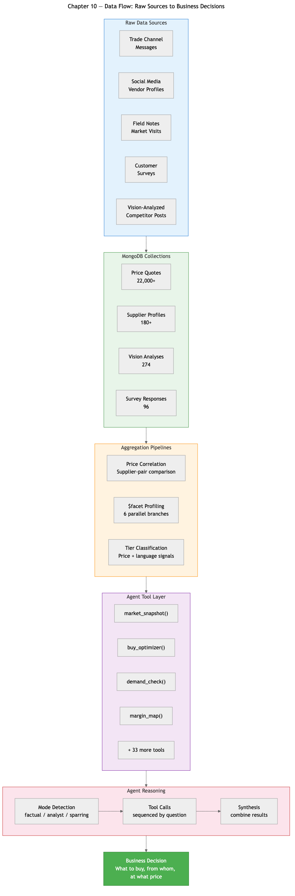
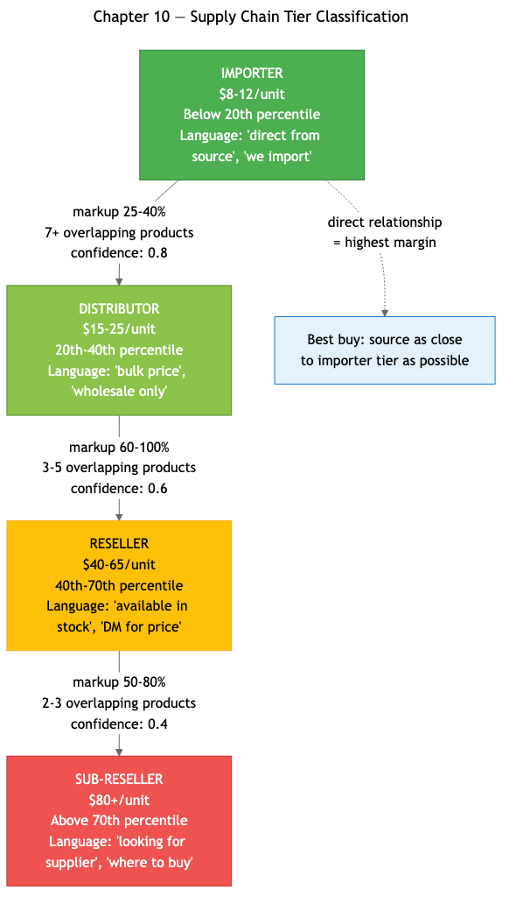
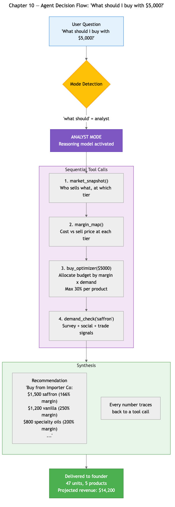
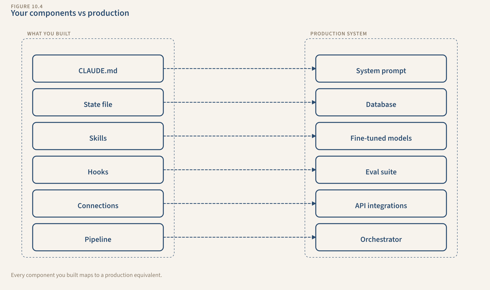
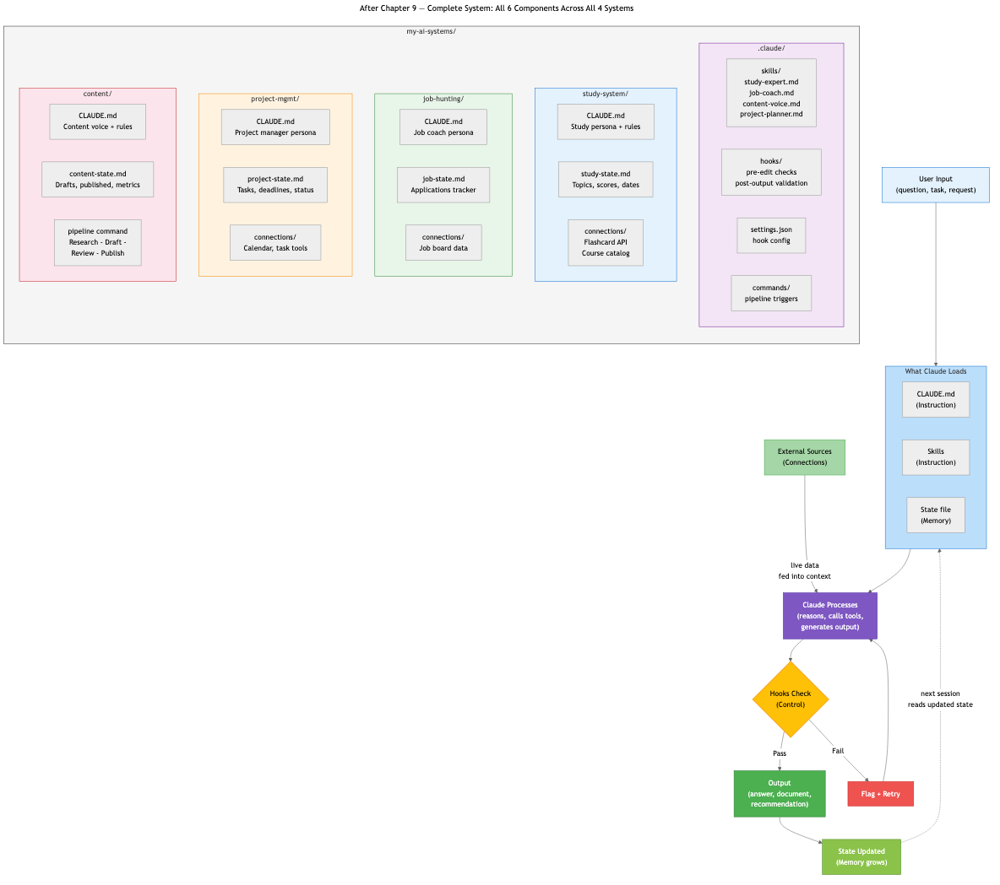

# Chapter 10: A Real System — Production Case Study

> **This is a preview of Chapter 10 from *From Prompts to Pipelines*.** It shows what a production AI system looks like — built using the same patterns taught in the book. The real business has been abstracted to protect competitive advantage, but every technical pattern is preserved exactly as it runs in production.

---

## What This System Does

An AI-powered purchasing advisor for a specialty import business. The operator asks one question — *"What should I buy with $5,000?"* — and gets a sourced, data-backed answer that would take a human analyst days to assemble manually.

That answer required:
- Data collection from 5 channels (trade groups, social media, surveys, field notes, vision analysis)
- Price normalization across 50+ suppliers
- Supply chain forensics (discovering who supplies whom through price correlation)
- Multi-signal demand weighting (urgency × frequency × margin × confidence)
- An AI agent with 37 specialized tools reasoning across all of it

**Every piece uses patterns from the book.** CLAUDE.md → agent system prompt. State files → MongoDB. Skills → 37 tools. Hooks → data quality gates. Connections → 5 data sources. Pipeline → ingest → aggregate → reason → decide.

---

## The Diagrams

### Data Flow: Raw Sources → Business Decision

Five data sources feed MongoDB collections. Aggregation pipelines (price correlation, $facet profiling, tier classification) produce structured intelligence. 37 agent tools query the intelligence. The agent reasons across all of it — then recommends what to buy, from whom, at what margin.

---

### Supply Chain Tiers — Discovered by the System

The system figured out the supply chain nobody publishes. Using price correlation forensics (if Supplier A is consistently 30%+ cheaper than Supplier B across 3+ overlapping products, A supplies B), it maps four tiers: Importers → Distributors → Resellers → Sub-resellers. Each tier has distinct price ranges, keyword patterns, and margin profiles.

---

### Agent Decision Flow: "$5,000 Budget"

The agent doesn't just answer — it decides *how* to think first. Mode detection (factual vs. analytical vs. strategic) selects the right AI model. Then it chains tool calls: market snapshot → margin map → buy optimizer → demand check → synthesized recommendation with specific units, suppliers, and projected revenue.

---

### Your Components → Production Scale

Every production component maps back to what the reader built in Chapters 4-9. The difference isn't the architecture — it's the scale. Same patterns, same feedback loops, different magnitude.

---

### The Complete System After Chapter 9

This is what the reader's `my-ai-systems/` directory looks like after the build chapters. Four systems, six components each, all working together. The production system in Chapter 10 is this — grown up.

---

## Read the Full Chapter

**[Chapter 10 Draft →](ch10-draft.md)**

~3,460 words. Covers the data layer (MongoDB aggregation), the agent layer (37 tools, 3 modes), the forensics model (price correlation, demand weighting, entity resolution), and maps every piece back to what the reader already knows.

---

## The Book

*From Prompts to Pipelines* teaches non-technical readers to build AI systems — not just prompts. 15 chapters, 4 throughline systems, 6 components. The reader goes from "quiz me on cloud computing" to a full pipeline that researches, drafts, reviews, and publishes — with automated quality gates.

**10 of 15 chapters drafted.** [Full progress →](../../book/book-state.md)
