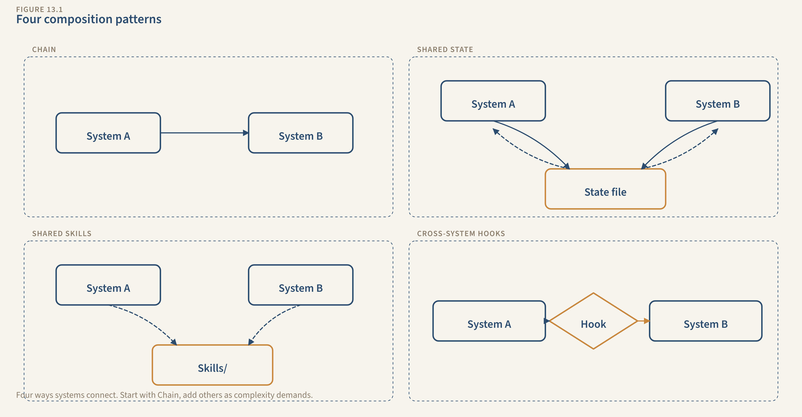
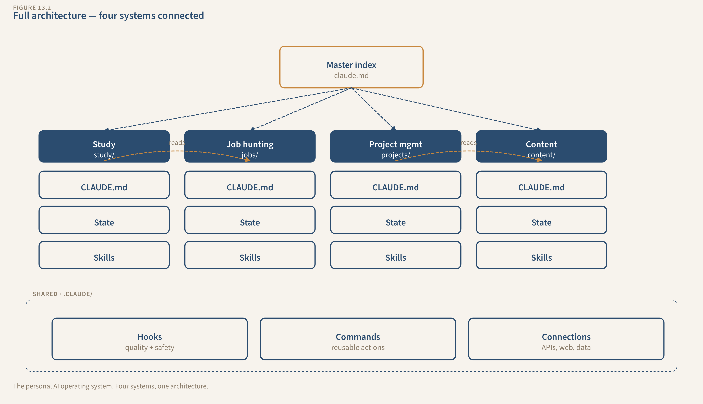

# Chapter 13: Composing Systems

You spent 3 weeks studying distributed systems for a certification. Your Study System tracked every session. 14 quiz scores, concept maps, 8 topics at mastery level. You know this material cold.

Tuesday, your Content System asks you what to write about. You tell it "distributed systems for non-technical managers." Claude researches the topic from scratch: web search, source gathering, outline from zero. It doesn't know you just spent 3 weeks building deep expertise on this exact subject. That expertise is sitting in your study-state.md. Claude never sees it because the Content System and the Study System don't know each other exist.

Meanwhile, your Job Hunting System is tailoring a cover letter for a distributed systems role. It cites your certification progress: "currently studying for [cert]." It doesn't mention the 3 blog posts you published about distributed systems through the Content System, because it doesn't know about them. Published posts are stronger evidence than "currently studying."

Four systems. Four separate worlds. You're the integration layer, manually carrying information between them. That's the problem you built systems to solve in the first place.

---

## The Rules of Composition

Before you wire anything together, four constraints. Violate them and you end up with a fragile monolith instead of a connected network.

**Rule 1: Independence first.** Every system must work alone. If you unplug every cross-system connection, each system functions exactly as it did in Chapter 9. The connections are a bonus, not a dependency. You'll test this at the end of the chapter.

**Rule 2: Reference, don't merge.** You're not combining four state files into one mega-state. You're building an index that tells each system where to look for relevant context from the other systems. A card catalog, not a single giant book.

**Rule 3: Loose coupling.** System A can USE information from System B. System A cannot DEPEND on System B running first, running correctly, or running at all. If System B's state file is empty, System A works fine. It just doesn't have the bonus context.

**Rule 4: Start with two.** Don't wire all four systems together at once. Connect the two with the most obvious value. Prove it works. Then add the next connection. The urge to build the "personal AI operating system" all at once is the "build it all at once" anti-pattern from Chapter 3.

The elegance isn't in the connections. It's in the fact that removing them changes nothing. Each system is still whole on its own.

---

## Four Composition Patterns

You've seen components within a single system. Composition applies them across systems. Four patterns cover every cross-system connection you'll need.

**Pattern 1: Chain.** One system's output becomes another system's input.

Study System produces a mastery summary. Content System uses it as research input for a blog post. The chain is explicit: you tell the Content System "use my study notes on [topic] as the research base for this post." The study-state.md becomes a source, same as a web search result.

When to use: when one system produces something another system needs as raw material.

*Picture it: a straight arrow from System A's output box to System B's input box. One direction. A feeds B.*

**Pattern 2: Shared State.** Multiple systems read from a cross-system index.

A master index file lists what each system has produced recently. The Content System checks the index and sees "Study System: mastered distributed systems, 14 sessions." The Job Hunting System checks it and sees "Content System: published 3 posts on distributed systems."

When to use: when systems need awareness of each other's output without directly consuming it.

*Picture it: a single file in the center with dotted read-lines going out to every system. The file is a bulletin board everyone checks, nobody owns.*

**Pattern 3: Shared Skills.** The same skill loads into multiple systems.

The editorial-voice skill already loads for Content. It could also load when the Job Hunting System writes cover letters: same voice, same word choice, same tone. The career-profile skill could load when the Content System writes about professional topics, citing your real experience.

When to use: when expertise is domain-general, not system-specific. Voice is voice everywhere. Career facts are career facts everywhere.

*Picture it: one skill file with arrows pointing into two or more systems. Same file, multiple consumers. Change it once, every system picks up the update.*

**Pattern 4: Cross-system Hooks.** A check in one system references another system's data.

The Content System's fact-check hook already verifies sources. Add a check: if the post claims you have expertise in X, cross-reference the study-state.md. Did you actually study X? If the Job Hunting System's cover letter cites a published post, cross-reference content-state.md. Does that post actually exist?

When to use: when one system makes claims about what another system produced.

*Picture it: a hook checkpoint inside System A with a verification line reaching into System B's state file. "Is this claim true?" The hook asks, System B's data answers.*



*The four composition patterns — each shows how data flows between two systems.*

---

## Build It: The Master Index

The foundation of composition: a lightweight file that gives every system visibility into the others.

Create `my-ai-systems/system-index.md`:

```markdown
# System Index

Last updated: [Claude updates this automatically]

## Study System
- **Active topics**: [pulled from study-state.md]
- **Mastered topics**: [topics at mastery level]
- **Current focus**: [this week's study priority]
- **Recent sessions**: [last 3 session dates and topics]

## Job Hunting System
- **Active applications**: [count of non-archived applications]
- **Recent callbacks**: [companies that responded positively]
- **Current resume version**: [which version is active]
- **Skills emphasized**: [what's working in applications]

## Project Management System
- **Active projects**: [project names and status]
- **Completed milestones**: [recent completions]
- **Blocked items**: [what's stuck and why]
- **Lessons learned**: [insights from recent project work]

## Content System
- **Published pieces**: [titles, dates, topics]
- **Upcoming topics**: [editorial calendar]
- **What's resonating**: [audience response data]
- **Drafts in progress**: [what's being worked on]

## Cross-System Opportunities
(Claude updates this section when it notices connections)
- [e.g., "Study System has mastery on 'distributed systems' → Content System could draft a post"]
- [e.g., "Content System published 3 posts on data infrastructure → Job Hunting System could cite these"]
```

This is 30 lines of markdown. Not a database. Not a combined state file that would balloon to 500 lines and drown Claude's attention. It's a quick-reference that says "here's what's happening across your four systems." Claude reads it in 2 seconds and knows whether System A has something useful for System B.

### Wire It Into Your Root CLAUDE.md

Add this section to your root `my-ai-systems/CLAUDE.md`:

```markdown
## System Index

Read `system-index.md` at the start of every session, regardless of which
system you're working in. Before ending any session, update the relevant
section of system-index.md with what changed.

The Cross-System Opportunities section: if you notice that one system's
output could benefit another system, note it there. I'll decide whether
to act on it.
```

Here's what happens: you start a Content session. Claude reads the index, sees that the Study System mastered "API design patterns" last week, and suggests: "Your study notes on API design patterns could be the basis for a blog post. Want me to pull from study-state.md?" You didn't ask for this. The system noticed the opportunity because the index made it visible.

---

## Build It: Cross-System Connections

Two connections, built in full. These demonstrate the two most common composition patterns.

### Connection 1: Study x Content (Chain Pattern)

The most natural connection: deep studying produces expertise that becomes content.

How it works:

1. You finish a study session on "event-driven architecture"
2. Study System updates study-state.md: topic at mastery level, 3 sessions, key concepts listed
3. Study System updates system-index.md: "Mastered: event-driven architecture"
4. Next Content session, Claude reads the index, sees the mastery entry
5. Claude suggests: "You've completed in-depth study of event-driven architecture. Ready to draft a post? I can use your study notes as the research foundation."
6. You agree. Claude reads study-state.md for the concept summaries, main points, and connections you made during study
7. Content pipeline runs, but the RESEARCH stage already has material from the study state. It supplements with web search for current examples, but the core expertise comes from your actual learning, not generic research
8. The resulting post has depth that a web-search-only draft wouldn't, because it's built on 3 weeks of structured learning

To make this work, update `content/CLAUDE.md`:

```markdown
## Cross-System: Study Integration

When drafting on a topic I've studied, check study-state.md for my notes,
mastery level, and key concepts. Use these as the research foundation.
Supplement with web search for current examples and external validation,
but ground the piece in what I actually learned.
```

The post you get back isn't just researched. It's informed by your actual understanding: the analogies you found helpful, the misconceptions you worked through, the connections to other topics. That's material no web search produces.

### Connection 2: Job Hunting x Content (Shared State Pattern)

Published content strengthens job applications. Job research reveals content opportunities. The information flows both directions.

How it works:

1. Content System publishes a post about data infrastructure. content-state.md logs it: title, date, topic, URL
2. System index updates: "Published: 'Why Your Data Pipeline Is Lying to You,' data infrastructure, May 2026"
3. Next Job Hunting session, Claude reads the index. You're applying for a data engineering role
4. Claude drafts the cover letter and includes: "I've written publicly about data infrastructure challenges. My recent piece explores [relevant angle]." The citation is real because it came from content-state.md
5. Going the other direction: you're researching companies for applications. Claude finds that Company X is investing heavily in observability. Claude updates the index: "Content opportunity: observability is a hot topic in the companies you're targeting. A blog post on observability would strengthen applications to Company X and Company Y."

To make this work, two CLAUDE.md updates:

In `job-hunting/CLAUDE.md`:
```markdown
## Cross-System: Content Integration

When writing cover letters, check system-index.md for published content
relevant to the role. If I've written about a topic related to this job,
cite the specific piece with its title and topic.
```

In `content/CLAUDE.md`:
```markdown
## Cross-System: Job Hunting Integration

When planning content topics, check system-index.md for job hunting
insights. Topics that align with my target roles are higher priority.
```

The cover letter that cites your published writing is stronger than one that doesn't. The blog post on a topic your target companies care about is more strategic than a random idea. Neither system could produce these results alone. Together, they're compounding.

---

## Extend It: Two More Connections

You know the pattern from the two builds above. Here's how composition applies to the remaining system pairs:

| System Pair | Pattern | What Connects | Example |
|---|---|---|---|
| PM x Content | Chain | PM milestones and lessons flow into Content as post material | PM logs "3-phase migration saved 2 weeks of rework" → Content spots it as a case study post |
| Study x Job Hunting | Shared State | Certification progress strengthens applications; job requirements reveal study gaps | Cover letter cites "14/20 topics at mastery, expected completion June" instead of just listing the cert |

The PM x Content chain works the same way as Study x Content: the PM System logs a milestone with a lessons-learned note, the index updates, and the Content System spots it as a post worth writing. Update `content/CLAUDE.md` to check the index for PM-derived opportunities, and `project-mgmt/CLAUDE.md` to flag completed milestones with a "content potential" tag.

The Study x Job Hunting shared state works both directions. Study progress strengthens cover letters with specific numbers. Job research reveals study gaps: "Role at Company X requires Kubernetes experience, not found in study-state.md." The system surfaces the gap before you notice it yourself.

Not every system pair needs an active connection. If Study and PM have nothing to say to each other right now, don't force it. Build the connections that produce clear value. Leave the rest alone until the opportunity appears in your index.

---

## The Independence Test

This is the most important test in the chapter. Not "do the connections work?" You already verified that. It's "do the systems still work WITHOUT the connections?"

**Test 1: Remove the index.** Rename `system-index.md` to `system-index-backup.md`. Start a Content session. Ask Claude to draft a blog post on a topic you studied. Claude won't see the study notes automatically. It'll research from scratch, like Chapter 9. The post is fine. It's just not as deep. The system works. The connection was a bonus, not a crutch.

**Test 2: Remove a shared skill reference.** Take the career-profile skill out of the Content System's CLAUDE.md. Draft a professional blog post. Claude doesn't cite your work history. The post is fine, just missing the personal authority. Restore the reference.

**Test 3: Remove a cross-system hook.** Disable the hook that cross-references content claims against study-state.md. Draft a post claiming expertise on a topic. The hook doesn't fire. The post might claim expertise you don't have. That's a risk, but the system still runs. Restore the hook.

Each test proves the same thing: the connection adds value, but removing it doesn't crash the system. That's loose coupling. Your systems cooperate when connected. They function when separated. A monolith can't say that.

If any test reveals a hard dependency, if removing a connection breaks a system, that's a bug. The system shouldn't need the connection. Fix it before moving on.

Here's why this matters: systems evolve. You'll add connections, remove them, swap one pattern for another. Six months from now, your Study System might not exist anymore. You passed the certification. If the Content System crashes because it can't find study-state.md, you built a monolith wearing a network costume. If the Content System works fine and just loses the study-grounded depth, you built composition correctly.

The test takes 10 minutes. Run it now, while the connections are fresh. You'll be glad you did when you start changing things later.

---

## The System Diagram



*The complete architecture — four independent systems, one master index, shared skills, and cross-system hooks. Your personal AI operating system.*

---

## What You Built

```
my-ai-systems/
├── CLAUDE.md                          ← root shared rules (updated)
├── system-index.md                    ← cross-system visibility (NEW)
├── .claude/
│   ├── settings.json                  ← hook registration
│   ├── skills/
│   │   ├── editorial-voice.md         ← shared: Content + Job Hunting
│   │   ├── content-standards.md       ← Content System
│   │   ├── study-method.md            ← Study System
│   │   ├── career-profile.md          ← shared: Job Hunting + Content
│   │   └── pm-methodology.md          ← Project Management System
│   └── hooks/
│       ├── verify-cover-letter.sh     ← may add cross-system checks
│       ├── check-duplicate-application.sh
│       ├── verify-quiz-answers.sh
│       ├── check-weak-area-focus.sh
│       ├── verify-status-consistency.sh
│       ├── check-audience-format.sh
│       └── verify-content-quality.sh
├── study-system/
│   ├── CLAUDE.md                      ← updated: index reference
│   └── study-state.md
├── job-hunting/
│   ├── CLAUDE.md                      ← updated: index + content refs
│   └── job-state.md
├── project-mgmt/
│   ├── CLAUDE.md                      ← updated: index reference
│   └── project-state.md
└── content/
    ├── CLAUDE.md                      ← updated: index + study refs
    └── content-state.md
```

One new file: system-index.md. CLAUDE.md updates in all four system folders and the root. No new hooks, no new skills, no new infrastructure. The composition layer is lightweight by design. The complexity lives in the systems themselves, built across Chapters 4 through 9. The wiring between them is just a few lines of markdown telling Claude where to look.

### The .claude/ Directory: Your System's Operating System

Look at that folder tree one more time. The `.claude/` directory is the engine room. Everything that makes your systems automatic (not just helpful) lives here:

| Folder/File | Role | Workflow analogy |
|---|---|---|
| `settings.json` | Control plane: what's allowed, what's checked, what triggers when | n8n's workflow settings and credentials |
| `skills/` | Loaded expertise: voice, methodology, domain knowledge | n8n's "Set" nodes that inject context |
| `hooks/` | Automated checks: validation layer between output and use | n8n's "IF" nodes and error handlers |
| `commands/` | Workflow definitions: multi-stage pipelines triggered by name | n8n's workflow canvas (the sequence of nodes) |

Together with the CLAUDE.md files (instructions) and state files (memory), this folder structure IS your agentic workflow. Not metaphorically. Literally. When you type a command, Claude reads the workflow definition, loads the relevant skills, executes stages in order, runs hooks between stages, and writes results to state. That's an agent executing a workflow.

The difference between this and a chat session: everything here is a file. You can version control it (git), share it (copy the folder), debug it (read the files), and evolve it (edit one file, behavior changes everywhere it's referenced). No platform lock-in. No subscription. No canvas that breaks when the vendor updates.

**Where this goes next.** The systems you've built are single-agent workflows: one AI session executing the stages. Production systems (like Chapter 10's supplier intelligence) often use multi-agent architectures: an orchestrator agent that delegates stages to specialized subagents, each with their own focused context. The orchestrator decides what to do. The subagents decide how. Think of it as n8n's sub-workflow feature: the main workflow calls a specialized sub-workflow for heavy lifting, then continues with the results.

You don't need multi-agent architecture for personal systems. But if you're curious where this pattern leads:

- Anthropic's Building Effective Agents guide: docs.anthropic.com/en/docs/build-with-claude/agentic-patterns
- Claude Code documentation on agents and subagents: docs.anthropic.com/en/docs/claude-code
- The orchestrator-worker pattern: one coordinator, multiple specialists, each with their own skills and context
- n8n's AI agent workflows (n8n.io/ai) for visual comparison of the same patterns

---

## How to Know It's Clicking

Five checks:

**The master index exists and is current.** `system-index.md` has entries for all four systems. The entries were updated within the last 3 sessions.

**At least 2 cross-system interactions worked.** You can point to a specific output (a blog post grounded in study notes, a cover letter citing published content, a study priority informed by job research) that used data from another system.

**The independence test passes.** You removed the index and ran each system. All four produced output. None crashed. The connections are a bonus, not a requirement.

**Shared skills load across systems.** The editorial-voice skill loaded during a Job Hunting session for cover letter voice. The career-profile skill loaded during a Content session for professional authority. Skills cross system boundaries without issue.

**You can explain the architecture.** "I have four systems. Each has 6 components and works independently. A master index gives each system visibility into the others. Shared skills carry expertise across systems. Cross-system hooks verify claims that reference other systems' data. Removing any connection changes nothing. Each system is whole on its own."

---

Your four systems work independently and together. You can debug them when they break. You've built a personal AI operating system. Not a monolith glued together with hope, but a network of independent systems that cooperate when connected and function when separated.

But here's the real question: can you build a fifth? Not by following a book, but by starting from a blank folder with a problem you want to solve. That's Chapter 14.
