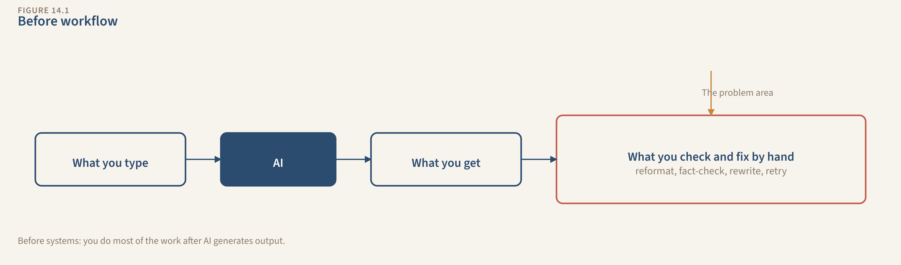
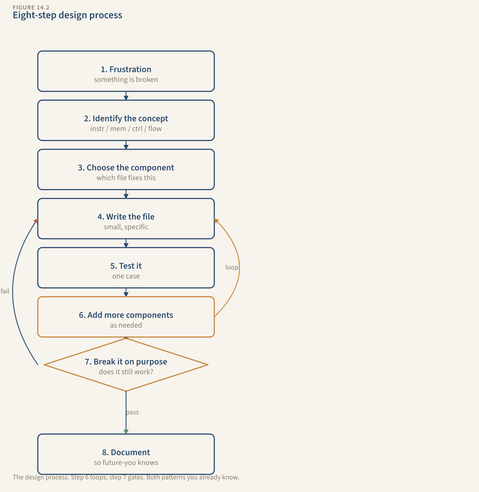

# Chapter 14: Designing New Systems

You've built four systems by following this book. Someone told you what file to create, what to type in it, when to run it. You followed the steps and it worked.

That's not design. That's assembly.

A person who assembles four IKEA bookshelves can put together a fifth IKEA bookshelf. A person who understands why bookshelves work (load distribution, shelf spacing, back panel rigidity) can build a bookshelf from raw lumber when there's no instruction manual.

This chapter is the raw lumber. You pick a problem the book never covered. You design the system. You build it. The chapter gives you the process, not the answer.

---

## When to Build a System vs. When a Prompt Is Fine

Not everything needs a system. Three conditions have to be true before you start building:

**You do the task repeatedly.** Weekly or daily. If it's quarterly, a prompt works fine. Systems have overhead: creating files, maintaining state, tuning hooks. That overhead only pays off with repetition.

**Context carries between sessions.** What happened last time matters this time. If every instance is independent (translating a paragraph, brainstorming names, summarizing a one-off article), a prompt handles it. No memory needed means no system needed.

**Mistakes cost something real.** If bad output means redoing 10 minutes of work, a prompt is fine. If bad output means a fabricated credential on a cover letter, an unsourced claim in a published post, or an allergic reaction from a meal plan, build a system.

The test: "Would this task be better if it remembered what happened last time?" If yes, you need at least state. That's the start of a system.

Tasks that don't need systems: translating a paragraph (one-shot, no context carries). Brainstorming project names (creative, disposable, no stakes). Summarizing a single article (independent, low-cost if wrong).

Tasks that do: managing client relationships over months (context carries, mistakes cost trust). Planning meals for a household each week (recurring, context carries: what you bought, what you ate, dietary restrictions). Running a side business's books (recurring, high-stakes, patterns matter over time).

The four systems in this book were chosen because all three conditions are obviously true. For your new system, verify all three before you start building. A system for a task that doesn't need one is worse than no system. It's overhead with no payoff.

---

## The 8-Step Design Process

I'm going to walk through each step with a running example (meal planning) so you can see how the decisions work. You're not building a meal planning system. You're building something else. The example shows the process. Your decisions are yours.

### Step 1: Start with frustration.

What task do you do repeatedly that AI helps with inconsistently? Write it down. Not "I want to use AI for meal planning." That's a solution looking for a problem. Start with the frustration.

"I spend 30 minutes every Sunday planning meals for the week, and every time I ask for help, I re-explain my dietary restrictions, what's in my fridge, and what we ate last week. The suggestions repeat. The grocery list doesn't account for what I already have. And last month it suggested a recipe with walnuts. I'm allergic to walnuts."

The frustration tells you what's broken. "I re-explain every time" = no memory. "Suggestions repeat" = no history tracking. "Didn't account for what I have" = no current state. "Suggested something I'm allergic to" = no guard rails. The frustration IS the diagnosis.

Try it. Write your frustration in one sentence. If you can't articulate it, you don't have a system problem yet. You have a vague desire. Come back when the frustration is specific.

### Step 2: Map your current workflow.

How are you doing this task right now? What do you paste into the AI? What do you re-explain? What do you check manually after?

Draw it:

```
[What you type] → [AI] → [What you get] → [What you check/fix by hand]
```

Everything after the last arrow is work the system should be doing.

Meal planning example: "I paste my dietary restrictions, what's in my fridge, what we ate this week, and ask for meal plans. I check that nothing contains allergens, that it uses fridge ingredients before suggesting purchases, and that it doesn't repeat Monday's dinner on Thursday."

Do this one yourself. Map your current workflow. What do you paste? What do you check? What do you wish it remembered?



*The "before" workflow — everything after the last arrow is work the system should be doing.*

### Step 3: Identify the constraint.

Of everything that breaks, what breaks MOST or costs the MOST? That's the constraint. Fix that first. Ignore everything else until it's resolved.

Meal planning: "The allergy check is the constraint. If the meal plan includes something I'm allergic to and I don't catch it, that's a health risk. Everything else is inconvenience. This one is safety."

Your constraint might be different. Maybe it's accuracy: the system fabricates data you can't easily verify. Maybe it's consistency: the output quality swings wildly between sessions. Maybe it's completeness: it handles the easy cases but drops the hard ones.

Name it. One constraint. That's where you start.

### Step 4: Choose a pattern.

Loop, Gate, or Router, from Chapter 3. Most systems combine two or three. Pick the primary one.

- If your task improves through iteration (draft, check, improve, repeat), it's a **Loop**.
- If your task has a quality bar that output must pass before you use it, it's a **Gate**.
- If different inputs need different handling, it's a **Router**.

Meal planning: Gate. The meal plan must pass allergy and dietary checks before I use it. I don't revise meal plans iteratively (not a Loop). All weeks get the same treatment (not a Router).

Sketch yours on a napkin. Boxes and arrows. If you can't sketch it with these three shapes, it's too complicated. Simplify.

### Step 5: Start minimal. Prompt only.

Build v1: just a CLAUDE.md and a structured prompt. No state file. No skills. No hooks. No connections. No pipeline.

One important note: your new system lives in the SAME project alongside your existing systems. The `.claude/` directory is shared infrastructure. When you add a skill for meal planning, it goes in the same `.claude/skills/` folder as your editorial-voice and career-profile skills. When you add a hook, it goes in `.claude/hooks/`. When you add a pipeline command, it goes in `.claude/commands/`. You're not starting from scratch. You're adding to a workflow engine that already has proven components. Some might even be reusable: your content-quality hook might work for meal plan descriptions too.

This will feel like going backward. You just spent ten chapters building systems with six components each. Starting with prompt-only feels like regression.

It's not. You know what all six components do. You've built them all. But for YOUR system, you don't know which ones you need yet. The only way to find out is to start with the prompt and let the failures tell you.

Meal planning v1: Create `meal-planning/CLAUDE.md` with dietary restrictions, household size, cooking skill level, and a structured prompt: "Given what's in my fridge and our schedule this week, generate a 7-day meal plan with a grocery list for items I don't already have."

Run it. It works for one week. Next week, it re-plans Monday's dinner because it doesn't remember last week. It suggests a recipe with walnuts because the allergy list isn't reliably loaded. Two failures, two components needed.

Now you. Build v1. Run it for real. What broke? Name the failure. Which component prevents it?

### Step 6: Add one component at a time.

For each failure, add the component that prevents it. One at a time. Run the system after each addition to verify the fix before adding the next.

The order depends on your constraint from Step 3:

- Biggest problem is "it forgets" → add **State**
- Biggest problem is "output quality is inconsistent" → add **Skill**
- Biggest problem is "it makes dangerous errors" → add **Hook** (start building the validation layer)
- Biggest problem is "it needs information I don't have" → add **Connection**
- Biggest problem is "it tries to do everything at once" → add **Pipeline**

Here's what this looks like in practice with the meal planning system.

#### 6a: Add the Hook (allergy safety)

The constraint is allergy safety, so that's the first component. Create a script that checks every recipe against the allergy list before the meal plan is finalized.

**Verify:** Run the system and deliberately include a recipe with walnuts. Does the hook catch it and flag the unsafe recipe? If yes, this component earned its place. If no, fix the hook before moving on.

#### 6b: Add State (meal history)

Now that allergy safety is handled, the next failure is repetition. The system doesn't remember last week. Add a state file that tracks what was planned, what was eaten, what's in the fridge, and what worked.

**Verify:** Run the system for a second week. Does it avoid repeating last week's meals? Does it use ingredients already in the fridge before suggesting purchases? If yes, move on.

#### 6c: Add the Skill (cooking expertise)

The output is safe and non-repetitive, but it doesn't match how the household actually eats. Add a skill file with cooking methodology, preferred cuisines, and complexity levels for weeknights vs. weekends.

**Verify:** Run the system again. Do weeknight meals stay simple? Do weekend meals get more ambitious? Does the cuisine mix match your preferences? If the output starts feeling like YOUR meal plan instead of a generic one, the skill is working.

Three components, added one at a time, each one earning its place by preventing a specific failure. Notice the pattern: add, verify, then decide what's next.

Now you. Which component does your system need FIRST? Add it. Run the system. Verify. Then identify the next.

### Step 7: Test by breaking.

Feed your system bad input. Skip steps. Lie to it. See what fails.

Meal planning: Tell the system "I have no dietary restrictions" when you actually do. Does the hook still catch allergens? It should. The hook references a fixed allergy file, not what you said in the session. If the hook relies on your session input instead of the skill file, it's brittle. Fix it.

For each failure that matters, add a check. For failures that don't matter (the system handles them gracefully or the consequences are trivial), leave them alone. Not every edge case needs a hook.

Test this now. What's the worst thing your system could do? Feed it that scenario deliberately. Did it fail safely or fail silently?

### Step 8: Document.

Create the system diagram. List each component, what it does, and what failure it prevents. Write a one-paragraph maintenance plan.

Meal planning:

```
[Fridge contents + schedule] + [CLAUDE.md + cooking skill + meal-state.md]
                                        |
                                     [Claude]
                                        |
                                [ALLERGY HOOK CHECK]
                                   |            |
                               [PASS]      [FAIL: flag unsafe recipe]
                                  |
                   [Meal plan + grocery list + state updated]
```

Components: CLAUDE.md (preferences, household size). Cooking skill (cuisines, complexity levels, format preferences). `meal-state.md` (what was planned, what was eaten, what's in the fridge, what worked). Allergy-check hook (hard stop on unsafe recipes).

Monthly maintenance: update fridge staples list, review whether preferred cuisines have shifted, verify allergy list is current, archive meal plans older than 8 weeks.

Your turn. Draw the diagram. List the components. Write the maintenance plan.



*The design process — eight steps from frustration to a documented system, with loops where you add components and gates where you test by breaking.*

---

## The Four Anti-Patterns

These are the traps that kill new systems. You'll be tempted by at least one of them. Name them now so you catch yourself later.

**"Just add more to the prompt."** Your CLAUDE.md keeps growing — every fix is another paragraph, until it contradicts itself and Claude ignores the bottom half. **Fix:** If you've patched the same kind of problem three or more times, it belongs in a different component. Expertise goes in a skill, session memory goes in state, quality checks go in hooks. The prompt orchestrates. It shouldn't do everything.

**"Build it all at once."** You design the perfect 6-component system on paper and spend 3 hours building before running it once — then half the components turn out wrong. **Fix:** Start with prompt only. Add one component when you can NAME the failure it prevents. If you can't name the failure, you don't need the component yet.

**"Automate everything."** You build a system for a quarterly task that takes 10 minutes. The system took 3 hours to build and needs 15 minutes of maintenance every month, forever. **Fix:** If you'll use the system less than once a week, think hard. Less than once a month? A prompt is almost certainly better.

**"Set it and forget it."** The system worked 3 months ago, but now the state file has 200 rows of stale data, the skill describes your old situation, and one hook hasn't fired in 8 weeks. The output looks plausible but is actively misleading. **Fix:** Schedule 30 minutes a month to review state, skills, hooks, connections, and pipeline performance. Refer back to the maintenance sections in each component chapter (Ch 5, 6, 7, 8, 9).

---

## Solo Flight: Build It

This is your solo flight. The chapter holds the guardrails. You do the work.

**Pick a domain.** Here are some that naturally benefit from systems. All three conditions (repeated, context carries, mistakes cost something) are true for each:

- Personal finance tracking and budget planning
- Fitness and health tracking
- Client or freelance project management
- Travel planning for recurring trips
- Home maintenance scheduling
- Language learning
- Team management and 1:1 preparation
- Side business operations
- Event planning
- Research projects (academic, market, competitive)

Pick the one where you feel the frustration from Step 1 most strongly. If none of these match, use your own. The process works for any domain where all three conditions are true.

**Now walk through the 8 steps.** Not as a thought exercise. Actually build it.

**Step 1:** Write your frustration sentence. What's broken about how you do this task with AI today?

**Step 2:** Draw your current workflow. What do you paste, check, re-explain every time?

**Step 3:** What's the constraint? What breaks most or costs the most when it goes wrong?

**Step 4:** Which pattern? Sketch it on paper. Boxes and arrows.

**Step 5:** Build v1. Just CLAUDE.md and a structured prompt. Open your terminal, create the folder, create the file. Run it.

**Step 6:** What broke? Add one component. Run again. What broke? Add the next. Keep going until the system handles your top 3 failures.

**Step 7:** Break it on purpose. Feed it the worst-case input. Does it fail safely?

**Step 8:** Draw the system diagram. List your components. Write the maintenance plan.

If you're stuck at any step, go back to the system in this book that's closest to yours. How did the Study System handle state? How did the Job Hunting System handle hooks? How did the Content System handle skills? The patterns transfer. That's the whole point of patterns.

---

## Check Your Design

Five questions to evaluate the system you just built.

**Can you name what each component prevents?** For every file in your system, say: "If I removed this, [specific bad thing] would happen." If you can't name the failure, you might not need the component. Remove it and test.

**Does the system start simple and grow?** Run the system with only the CLAUDE.md. Then add state. Then skill. At each stage, the system should produce measurably better output. If adding a component doesn't improve things, it's not earning its place.

**Is the prompt under control?** Your CLAUDE.md should be under 500 words. If it's longer, expertise probably belongs in a skill, session data belongs in state, and quality checks belong in hooks. The prompt orchestrates. Other components do the work.

**Can you break it safely?** Feed the system its worst-case input. Does it fail loudly (hook catches it, flags it, stops) or fail silently (bad output ships and you don't notice)? If it fails silently, you need a hook for that failure mode.

**Is there a maintenance plan?** What will you check monthly? What might drift? When would you update the skill? When would you archive stale state? A system without maintenance is a system with an expiration date you can't see.

---

## How to Know It's Clicking

Five checks:

**You built a system for a new problem.** Not a copy of the Study System with different labels. A different domain with different requirements, different constraints, different component priorities.

**The system has at least 3 components.** At minimum: CLAUDE.md, a state file, and either a skill or a hook. More is fine if each component prevents a named failure. Fewer means you might not need a system. A prompt might be enough.

**You followed the process, not your instinct.** You started with prompt-only v1. You ran it. You identified what broke. You added components one at a time. You didn't design the full system on paper and build it all at once.

**You can draw the architecture.** On a napkin, on a whiteboard, on the back of a receipt. Every component, what it does, one sentence each. If you can't explain it simply, it's too complicated.

**The system works for real.** Not a thought experiment. You ran it. It produced output. The output got better with each component you added. The hooks caught at least one bad input when you tested by breaking.

You just designed and built a system the book never taught you. The four systems were training wheels. This one is yours. You chose the domain, identified the constraint, picked the pattern, decided which components to add and in what order. That's the skill. Everything else in this book was building toward this.
