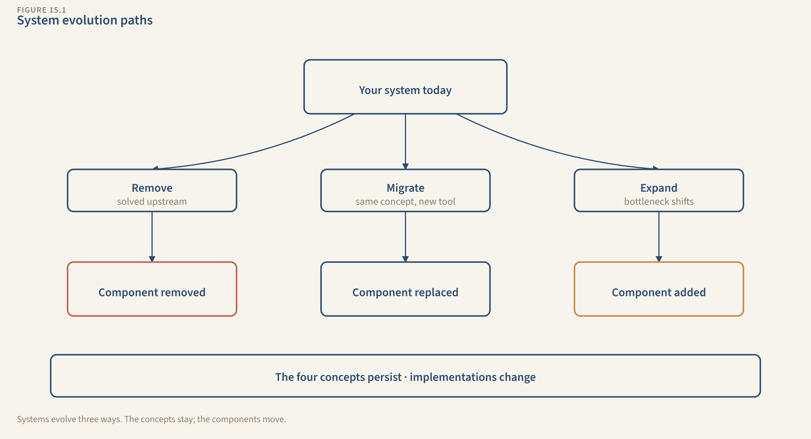
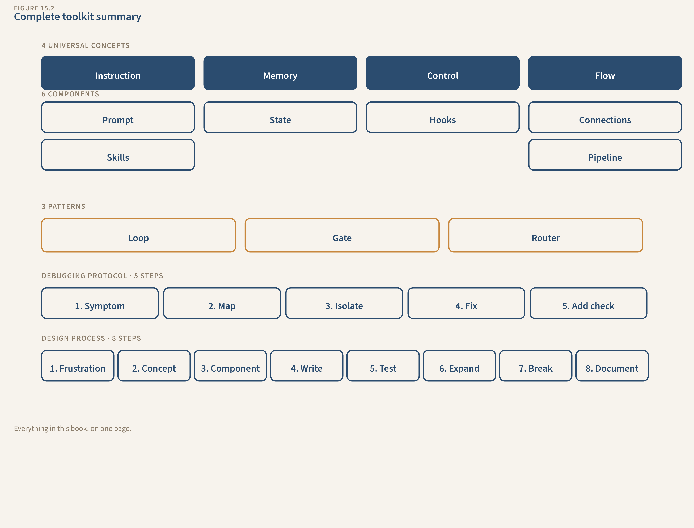

# Chapter 15: What's Next

The tools will change. Six months from now, the AI will be better at following instructions, worse at some new edge case nobody predicted, and different in ways that make today's workarounds unnecessary. A year from now, there might be a tool that makes half your hooks redundant. Two years from now, the field will look nothing like today.

Your systems will still work.

Not because they're frozen in time. The framework underneath them doesn't expire. Instruction, Memory, Control, Flow. Those four concepts describe every AI system that exists today, every one that existed two years ago, and every one that will exist in five years. The implementations change. The concepts don't.

This chapter is about what happens after the book. Not a recap. You were there, you built the systems. A practical guide to evolving what you've built, staying informed without drowning, evaluating new tools without starting over, and helping others see what you now see.

---

## Your Systems Will Change. Here's How

Right now, your systems need hooks to catch fabricated credentials, state files to compensate for the AI's session-to-session amnesia, and skill files to teach it what your voice sounds like. Those are today's constraints. Some of them will shrink as AI improves.

A model that hallucinates 90% less might not need the fabrication-check hook. A model with persistent memory across sessions might not need a state file at all. A model that learns your writing style from three examples might not need a 1,500-word voice skill.

Your response to that shouldn't be "Great, I'll strip everything out." It should be: "The fabrication-check hook hasn't fired in two months. Let me test it with known-bad input. If the risk has genuinely dropped below my threshold, I'll remove it. If the hook still catches things the AI misses, I'll keep it."

That's the maintenance mindset applied to evolution.

**Three ways your systems will evolve:**

**Component removal.** The best kind of evolution. If the AI gets reliably better at something your hook was checking, you can remove the hook. If it remembers context across sessions on its own, your state files might shrink to just the derived insights (callback rates, weak-area trends, editorial calendar) that the AI wouldn't generate unprompted. Removing a component means the problem it solved is solved upstream. That's progress. But verify before you remove. "It seems better" is a feeling. "The hook hasn't fired on 50 consecutive runs, and I tested with known-bad input" is evidence.

**Component migration.** Today, you check facts with a shell script. Tomorrow, the tool might have built-in fact-checking. Your hook becomes a toggle in a settings menu instead of a script in your hooks folder. The concept (Control) stays. The implementation changes. That's fine. You understand the concept. When you see a new tool's "verification settings" page, you'll know exactly what it is: it's your hook, wearing different clothes.

**New constraints appear.** This is the one people don't expect. Today's bottleneck is output quality: the AI produces good-enough work, but you need hooks and skills to push it from good-enough to right. Tomorrow's bottleneck might be input quality: the AI is so capable that the limiting factor becomes how well you describe what you want. Your prompt, the first component you learned, might need the most attention again.

Or the bottleneck shifts to integration complexity. The AI can connect to 50 different tools. Choosing the right 3, configuring them correctly, and keeping them maintained becomes the hard part. Your Connection component gets more complex while your Skill component gets simpler.

Or (and this is the subtle one) trust calibration. The AI's output gets good enough that you stop checking it. You disable a hook because it hasn't fired in weeks. Then the rare but costly error slips through, and you realize the hook wasn't redundant. It was handling the 2% case that matters most. Knowing when to trust and when to verify is a skill the framework teaches but experience sharpens.

*How systems evolve — components get removed, migrate to new implementations, or shift as new constraints appear. The four concepts persist through all of it.*

---

## Staying Current Without Drowning

You're going to encounter an overwhelming flood of AI news. New tools every week. New features every month. Thought leaders with contradictory advice. Headlines that make your current setup sound obsolete before you've finished reading the article.

Ignore most of it. Here's how.

**The 3 sources rule.** Pick 3 sources of AI information that are relevant to your actual work. Not AI in general. AI as it applies to the kind of systems you build.

**One official source.** The blog or changelog for the tool you use most. If you're using Claude Code, that's Anthropic's blog and the Claude Code release notes. This is where you learn about new features that might affect your systems. Not the AI research papers. Not the benchmark comparisons. The changelog.

**One practitioner source.** A person who builds with AI the way you do. Not an AI researcher publishing papers, not a hype account posting "10 mind-blowing AI tricks." Someone who shows their actual workflows, talks about what broke, and explains what they changed. You'll know them because their posts include file paths and error messages, not just screenshots of impressive output.

**One community source.** A forum, subreddit, or Discord where people discuss the same tools you use. This is where you learn about bugs before the changelog mentions them, workarounds that aren't in the docs, and real-world use cases that stress-test features in ways the official tutorials don't.

Three sources. Not 30. Not a daily newsletter that aggregates 50 AI stories. Three.

**When to update your systems for new capabilities.** Not every time a feature ships. Only when:

1. The feature addresses a SPECIFIC constraint you currently experience. "Built-in memory" matters if your state files are a pain point. "Better image generation" doesn't matter if you don't generate images.
2. You can test it in 30 minutes against your existing system. If evaluating the feature requires rebuilding a component from scratch, wait until you have a clear afternoon, not a Tuesday night.
3. The improvement is measurable. Not "it seems better" but "the hook fired 3 times in 50 runs instead of 12 times in 50 runs." Numbers. Evidence.

**When to wait.** When a feature is "interesting" but doesn't address a constraint you have. When it's in beta and might change next month. When adopting it would require rebuilding a component that already works fine.

"New feature" and "useful for my workflow" are different categories. Most new features are interesting and irrelevant. A few are interesting and essential. The three conditions above sort them.

If you spent more than 30 minutes this week reading about AI tools instead of using your AI systems, you're drifting. Close the tabs. Open your terminal. Run a system. The system teaches you more about what AI can do than any article about what AI might do.

---

## Evaluating New Tools: The 30-Minute Assessment

A new tool appears. Everyone says it changes everything. Your feed is full of demos. Here's how to evaluate it in 30 minutes without getting swept up.

**Minutes 0-5: Map to the four concepts.** Open the tool's docs or marketing page. For each universal concept, answer one question:

| Concept | Question | What to Look For |
|---------|----------|-----------------|
| Instruction | Can I give it persistent, structured instructions? | Settings files, system prompts, project configs. Something that loads automatically every session |
| Memory | Does it remember across sessions? | File persistence, state management, conversation history that carries forward |
| Control | Can I add automated checks on output? | Hooks, plugins, review stages, a validation layer. Something that catches mistakes without me reading every line |
| Flow | Can I build multi-stage workflows? | Pipelines, chained actions, conditional logic. Work that happens in stages, not all at once |

A tool that supports all four is worth 25 more minutes. A tool that only supports Instruction (you can give it a prompt, but it forgets everything, can't check its own work, and does everything in one shot) is a chat interface with better marketing.

**Minutes 5-15: Run your simplest system.** Take your Study System (or whichever is simplest) and try to rebuild v1 in the new tool. Just the structured prompt. Can you give it persistent instructions? Does the output match what you get from your current tool? How does it handle the same input?

You're not looking for "is this tool amazing." You're looking for "can this tool run my system."

**Minutes 15-25: Add state.** Can you create a file the tool reads at session start and writes to at session end? If the tool doesn't support persistent files, it can't do Memory. Every session starts from zero. That's a dealbreaker for anyone who builds systems. Some tools hide state behind a GUI: saved conversations, "memories," preference panels. Check whether you can see and edit the actual data. If you can't, you can't debug it. And you will need to debug it.

**Minutes 25-30: Score it.** Three dimensions:

**Component support.** How many of the 6 components can it handle? Prompt, State, Skill, Hook, Connection, Pipeline. A tool that handles 4 out of 6 might be worth migrating to if it handles the 4 you use most. A tool that handles 2 out of 6 isn't ready for system builders.

**File transparency.** Can you see and edit the system's files directly? Markdown files you can open in any editor? Or is everything locked behind a proprietary interface? Transparent files mean you own your system. Opaque files mean the tool owns it.

**Migration effort.** How much work to move your existing systems here? If it uses the same file formats (markdown, JSON, shell scripts), migration is copying a folder. If it requires proprietary formats, you're rewriting, not migrating. And you're locked in.

You're not evaluating whether the tool is good. You're evaluating whether it can run your systems. A tool with great output quality but no state management is useless for what you've built. A tool with mediocre output but full component support might be exactly what you need. The framework tells you what to look for. The marketing tells you what they want you to look for. Trust the framework.

---

## Teaching Others

You have a skill most people don't. They use AI the way you used to: paste a prompt, get output, check it manually, re-explain next time. They don't know there's another way.

**The 15-minute demo.** When someone asks "how do you use AI?", don't explain the theory. Show the system.

Open your Content System (or whichever is most visible). Walk through five things:

1. **The CLAUDE.md.** "This file loads automatically every session. It tells Claude who I am, how I work, and what to do. I never re-explain this."
2. **The state file.** "This tracks what's happened. Claude reads it at the start, writes to it at the end. It knows what I've already written, what topics I've covered, what's working. I don't paste any of this."
3. **The skill file.** "This is my voice. My writing style, loaded into a file. Claude reads it before drafting anything. That's why the output sounds like me and not like... AI."
4. **The hook.** "This catches mistakes automatically." Feed it deliberately bad input. Watch the hook flag it. "I didn't check that. The system checked it."
5. **The output.** "This is what the system produces. Not one prompt. A system with memory, expertise, and quality checks working together."

Fifteen minutes. The person sees the difference between a prompt and a system. They don't need to understand every component. They need to see that the gap exists and that it's closable.

**Building shared systems.** If you work with a team, the framework scales naturally:

Shared skills become team standards: voice guides, methodology documents, domain expertise that everyone loads. Shared hooks become quality floors: checks that enforce team standards regardless of who's running the system. Individual CLAUDE.md files reflect each person's role and preferences, but the shared components keep everyone's output above a minimum bar.

A team where everyone writes their own prompts is a team where quality depends on who's prompting. A team that shares skills and hooks is a team where the floor is high and consistent.

**The two questions that open the door.** When you're talking to someone who uses AI casually, don't lecture. Ask:

"What do you re-explain every time you start a new chat?" That's missing Memory. They'll recognize it immediately. The frustration of re-pasting context, re-describing preferences, re-establishing who they are.

"How do you know the output is right?" That's missing Control. They'll usually pause. The honest answer is "I read the whole thing carefully" or "I mostly trust it." Both answers reveal the gap.

Those two questions do more than a 30-minute presentation. The person sees the problem in their own workflow. They ask "how do I fix that?" You show them the system.

---

## Your Toolkit

What you have now that you didn't have 14 chapters ago:

*The complete toolkit — everything you learned in one reference. Tear this page out and tape it to your monitor.*

---

## Where to Go Deeper

This book got you building. It deliberately stayed at the systems level and skipped the theory underneath. Now that your systems are running and producing real output, here's where to go deeper.

Start with whichever row addresses your biggest current bottleneck. If your systems produce inconsistent output, start with prompt engineering. If they're slow or expensive, start with model selection. Let the system tell you what to learn next.

| Topic | When to explore | Best resource |
|-------|----------------|---------------|
| **Prompt engineering** — chain-of-thought, few-shot learning, prompt chaining | Your prompts work but output quality is inconsistent across runs | Anthropic's prompt engineering docs (docs.anthropic.com/en/docs/build-with-claude/prompt-engineering) |
| **How LLMs actually work** — tokens, attention, temperature, context windows | You need to debug WHY a system fails, not just WHAT failed | Andrej Karpathy's YouTube lectures |
| **Model selection and routing** — benchmarks, cost-per-quality, open-source vs. commercial | Your systems work but cost too much or run too slow | Artificial Analysis (artificialanalysis.ai) for benchmark comparisons |
| **Context window management** — compression, summarization, chunking | Your state files and skills are getting large enough that the AI "forgets" parts of them | Anthropic's long context guide (docs.anthropic.com) |
| **Advanced agent architectures** — orchestrator-worker patterns, evaluation loops, autonomous planning | You want systems that run without you approving every step | Anthropic's Building Effective Agents guide (docs.anthropic.com/en/docs/build-with-claude/agentic-patterns) |
| **Systems thinking foundations** — stocks, flows, feedback loops, constraints, leverage points | You want to understand WHY the framework works, not just HOW | *Thinking in Systems* (Meadows), *The Goal* (Goldratt), *Enter the System* (Danaher) |

Short on time? Search YouTube for "Goldratt Theory of Constraints explained" and "Donella Meadows systems thinking." Ten-minute overviews that land differently now that you've built the systems yourself.

---

## How to Know It's Clicking

Three checks.

**You can evaluate a new AI tool in 30 minutes.** Not based on the marketing page. Not based on a demo video. You opened it, mapped it to the four concepts, tested your simplest system, scored it on component support, file transparency, and migration effort. You have a verdict backed by your own testing.

**You can explain the systems approach in under 5 minutes.** To someone who has never opened a terminal. Without jargon. Using THEIR workflow as the example, not yours. You asked the two questions, showed the gap, and demonstrated what a system looks like. They walked away thinking differently about how they use AI.

**You don't need this book to build the next system.** You don't need a new course when a new tool ships. You don't need someone to tell you which file to create. You have the concepts, the components, the patterns, the process. The next system is yours.
