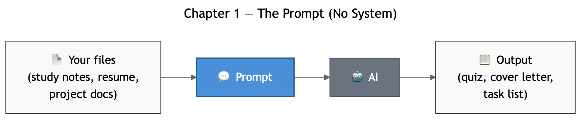
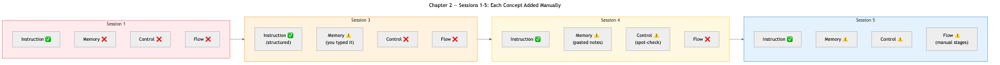
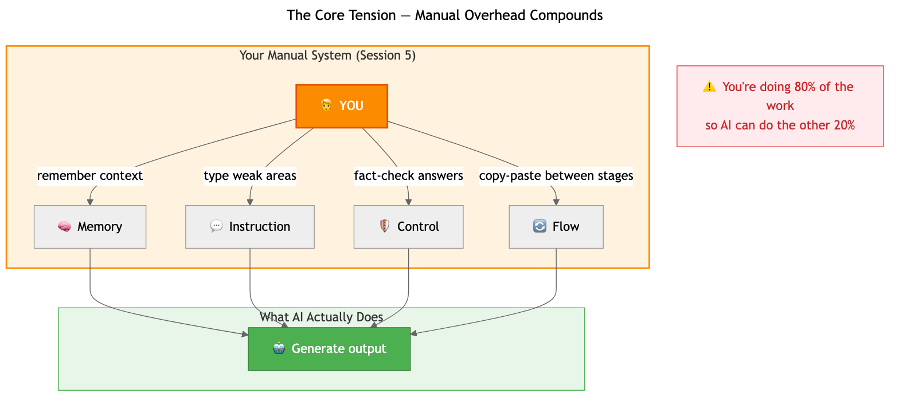
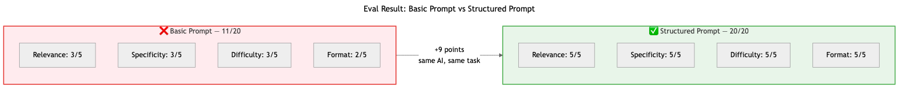

# Book Diagrams

Mermaid source files rendered to SVG (web/ebook) and PNG (print/GitHub preview).

## Rendering

```bash
bash book/diagrams/render.sh
```

Requires `mmdc` (mermaid CLI): `npm install -g @mermaid-js/mermaid-cli puppeteer`

## Chapter 1 — You're Already Building Systems

| Diagram | What It Shows |
|---------|--------------|
|  | The one-shot: input → prompt → AI → output. No feedback loop. |
|  | After Session 2: Instruction is present, Memory/Control/Flow are missing. |

## Chapter 2 — Going Deeper

| Diagram | What It Shows |
|---------|--------------|
|  | Sessions 1→5: each adds a concept manually. Warning icons show manual effort. |
|  | The core tension: YOU provide all 4 concepts by hand. AI just generates. |
|  | Research data: basic prompt 11/20 vs structured prompt 20/20. |

## Chapter 3 — Design Patterns

| Diagram | What It Shows |
|---------|--------------|
|  | Pattern 1: Process → Check → Improve → Repeat |
|  | Pattern 2: Stage → Quality Check → Pass or Rework |
|  | Pattern 3: Decision Point → Path A / B / C |
|  | The full Study System — all 3 patterns combined with Memory and Control labeled. |

## File Structure

```
diagrams/
├── src/          # Mermaid source files (.mmd)
├── svg/          # Rendered SVGs (scalable, web/ebook)
├── png/          # Rendered PNGs (print, GitHub preview)
├── render.sh     # Render all diagrams
└── README.md     # This file
```
